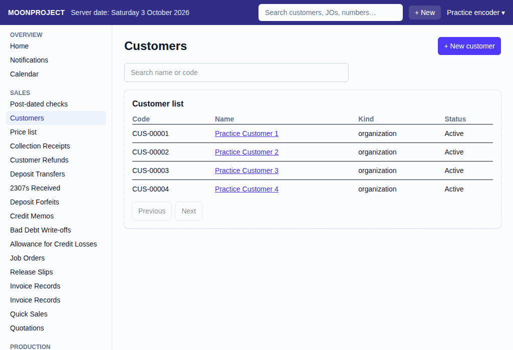
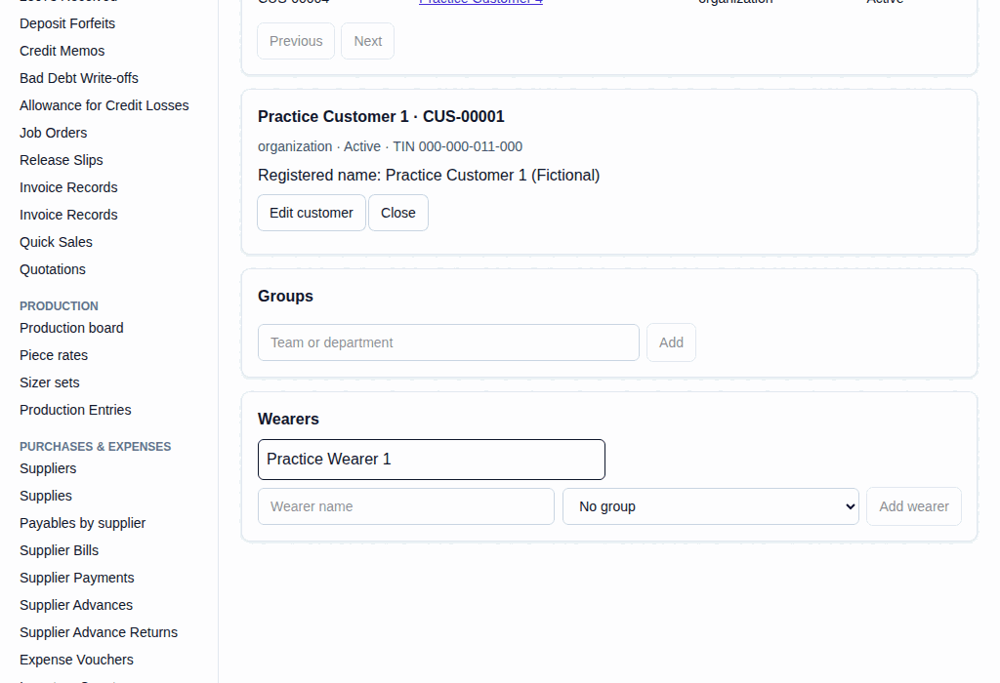

# 1. New Customer and Measurements

**What it is for:** Add a new customer, their departments or groups, and the people (wearers) who will be measured, then type their exact measurements (or revise them).

**Before you start:** Know the customer's name. If it is a large group like a school, it helps to know their department names.

### Steps
1. On the **Sales** menu, click **Customers**.
   
2. Click **+ New customer**.
3. Type the customer's details and click **Save**.
4. To add people, click the **Wearers** section.
   
5. If the wearer belongs to a team or department, you can type it and click **Add** (or pick an existing one).
6. Type the wearer's name and click **Add wearer**.
7. To enter their measurements, click their name in the Wearers list.
8. Under **Entry type**, choose **Measurements**, choose the **Unit**, and type the measurements, describe what changed if this is a revision, and click **Save revision**.

### What the system does for you
It keeps a complete history of every measurement revision. When you make a job order later, you can pull in this customer and these specific people, and the system knows exactly which measurements to use.

### Common mistakes and how to fix them
- **Mistake:** You entered the wrong measurements for a wearer.
- **Fix:** Do not try to delete the wearer (nothing can be deleted). Just click on their name again, enter the correct measurements, and click **Save revision**. The system keeps the old ones on file but will use the new ones.
