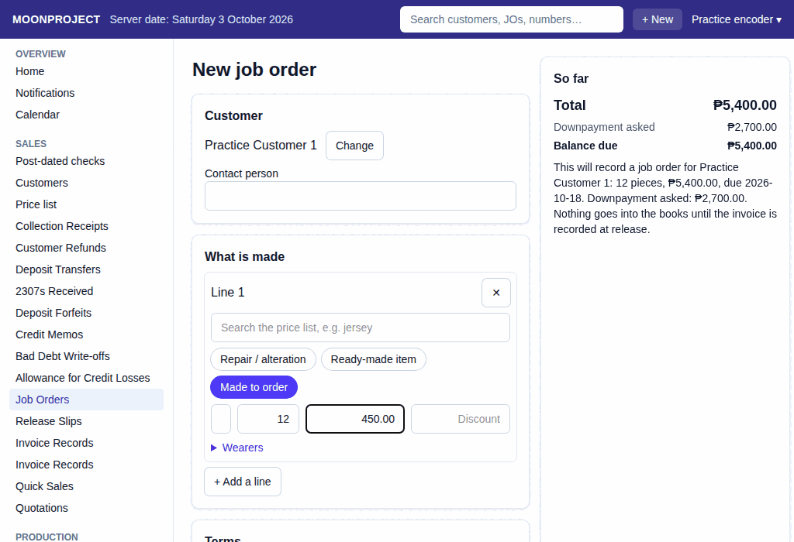

# 2. Job Order and Downpayment

**What it is for:** Record a new job order, add the items to be made, assign wearers if applicable, and log the initial downpayment.

**Before you start:** Make sure the customer (and any wearers) are already in the system. Know the items to be made and the downpayment amount received.

### Steps
1. On the **Sales** menu, click **Job Orders**.
2. Click **+ New Job Order**.
3. Pick the customer.
4. Add lines for the items the customer wants to order.
   
5. Review the details and click **Record**, check the confirmation, then click **Record** again.
6. On the recorded job order, click **Take the downpayment**. In deposit VAT mode C, record the downpayment invoice first; then record the collection. For another payment, click **Take a payment**. See guide 37.

### What the system does for you
It creates a tracked job order that will move through production stages. It automatically calculates the **Balance due**. Any downpayment you take is logged as a deposit until the order is finally released and invoiced.

### Common mistakes and how to fix them
- **Mistake:** You entered the wrong item or wrong amount on the job order.
- **Fix:** You cannot edit a saved document, and you should never delete it. Instead, view the document and click **Edit** (this will cancel the incorrect one and let you redo it with a new number).
