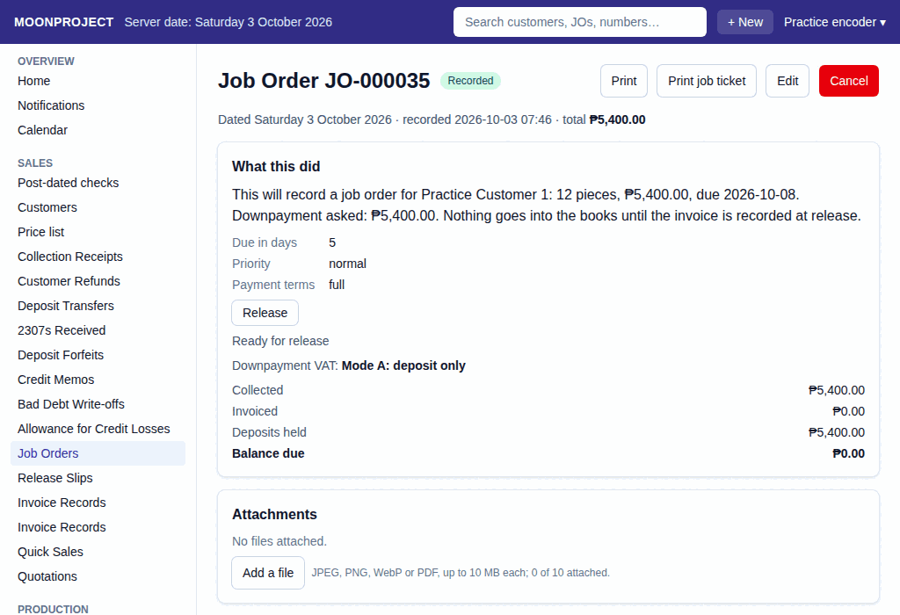
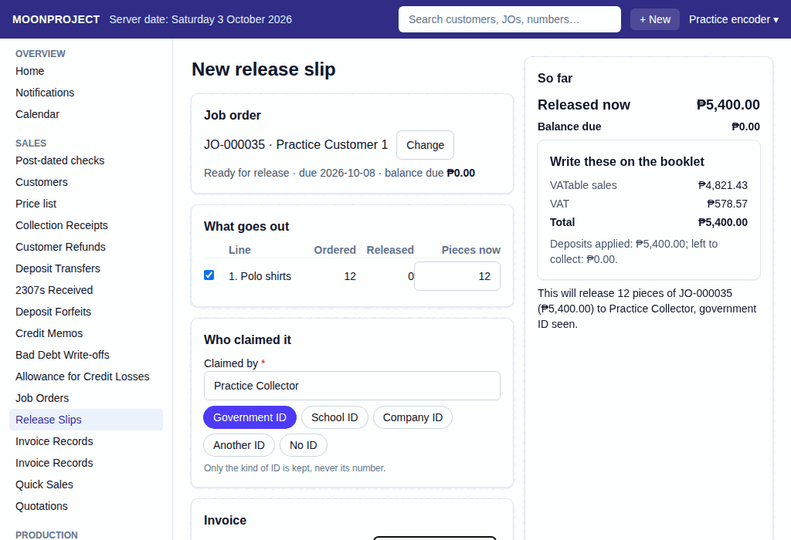

# 3. Release and Invoice

**What it is for:** Hand over finished goods to the customer and record the official manual booklet invoice number.

**Before you start:** The job order must be marked as ready. Have your BIR sales invoice booklet ready.

### Steps
1. Open the job order that is ready to be claimed.
   
2. Click **Release** to create a release slip.
3. Select which items (and how many pieces) are being released.
4. Record who claimed the items and what ID was seen.
   
5. Under **Invoice**, type **Invoice number (from the booklet)**, or tick **Invoice to follow (the booklet is not at hand)**. Click **Record**, review **Record this release?**, then click **Record** again.
6. If you recorded the invoice with the release, you are done. If the invoice is to follow, continue here: click **Record invoice** on the job order, or open **Invoice Records** under **Sales**. Pick the release.
7. Under **Write these on the booklet**, copy **VATable sales**, **VAT**, and **Total** to the physical booklet.
8. Type **Invoice number (from the booklet)** and **Date on the invoice**. Click **Record**, check the confirmation, and click **Record** again.

### What the system does for you
It updates the job order to show how many pieces are left to claim. When you record the invoice, it automatically moves the customer's downpayment from "deposits" to pay off the invoice, and books the official sale and VAT for the accountant.

### Common mistakes and how to fix them
- **Mistake:** You typed the wrong booklet invoice number.
- **Fix:** Never delete the record. Cancel the invoice record (the release slip stays), and create a new invoice record using the correct booklet number. Mark the physical booklet invoice as "cancelled (all copies kept)".

### Printed date on an invoice record

**What it is for:** Record the PRINTED DATE from the booklet or paper document, including when you type it later.

**Before you start:** Have the paper in front of you. The date must be real, today or earlier, and outside a month the accountant has signed off.

**Steps:**
1. Fill **Date on the invoice** with the date printed on the paper. Leave it empty only when that date is today.
2. Click **Record**, check the date and amounts, then click **Record** again.

**What the system does:** The recorded document and its journal use this date; its VAT goes to that month. The app still keeps when it was entered. It refuses a future date, an impossible date, or a date in a signed-off month.

**Common mistakes:** "Type the date printed on the document like 2026-09-30, or leave it empty for today." means check the day, month and year. "The date printed on the document cannot be after today (...)" means check the paper and the shop PC's date. "... is already signed off at month-end, so nothing new is dated ..." means stop and ask the accountant; do not change the true date just to get past it.
