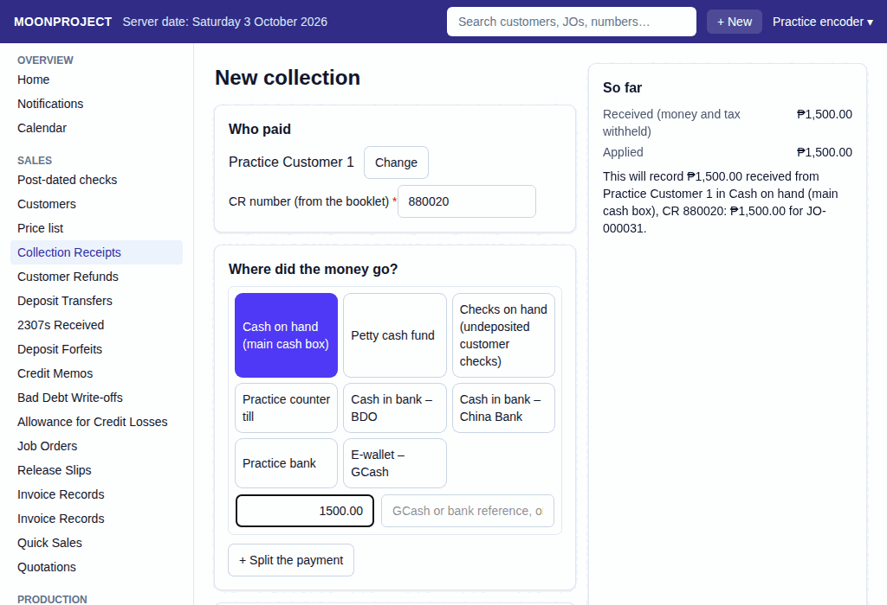

# 4. Collection

**What it is for:** Record money received from a customer to pay off their balance due or add to their deposits.

**Before you start:** Know the exact amount received, where it went (Cash, GCash, Bank), and have any 2307 withholding certificates from the customer.

### Steps
1. On the **Sales** menu, click **Collections**.
2. Click **+ New**.
3. Pick the customer or the specific job order.
4. Type the amount received.
5. If the customer withheld tax, open **Customer withheld tax (2307)** and type **Amount withheld**. This section stays open when withholding is already in use.
6. Under "Where did the money go?", click the button for where you put the money (e.g., **Cash on hand**, **GCash**). You can split the amount if they paid partly in cash and partly in GCash.
   
7. Click **Record**.

### What the system does for you
It immediately updates the cash balances so the shop knows exactly how much money is in the drawer or GCash. It automatically lowers the customer's balance due or adds it to their deposits.

### Common mistakes and how to fix them
- **Mistake:** You clicked GCash but the money was actually handed to you in Cash.
- **Fix:** Never delete the record. View the collection and click **Edit**. The system will cancel the old one (reversing the mistake) and let you record a new collection with the right cash place.
