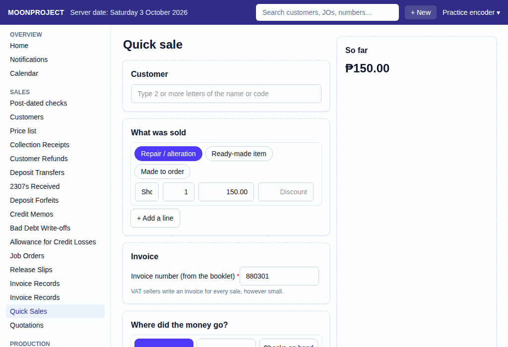

# 5. Quick Sale

**What it is for:** Quickly record a walk-in sale where the customer pays and takes the item immediately.

**Before you start:** Have your BIR sales invoice booklet ready to write on. Know what the customer is buying and how they are paying.

### Steps
1. On the **Sales** menu, click **Quick Sales**.
2. Click **+ New Quick Sale**.
3. Under the lines, type the **Description** (e.g., Shorten sleeves) and the **Price each**.
4. Choose how they paid (e.g., **Cash on hand**, **GCash**).
   
5. Type the booklet invoice number.
6. Click **Record**.

### What the system does for you
In one fast step, it records the sale, updates the cash balance, and logs the invoice for the accountant. It handles all the VAT math automatically.

### Common mistakes and how to fix them
- **Mistake:** You typed the wrong price or the wrong booklet invoice number.
- **Fix:** Never delete the record. View the quick sale and click **Edit**. The system will cancel it and let you make a new one. Mark the physical booklet invoice as "cancelled (all copies kept)".
