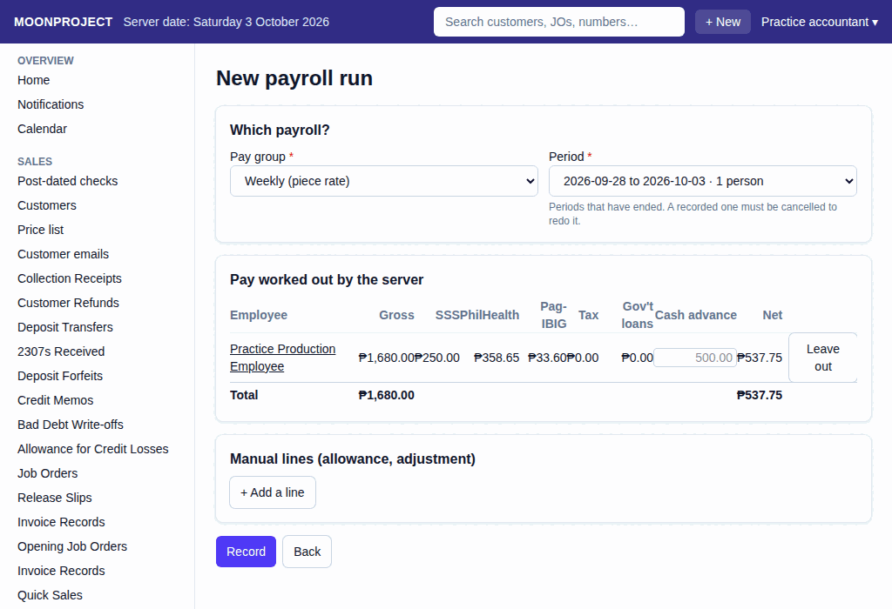
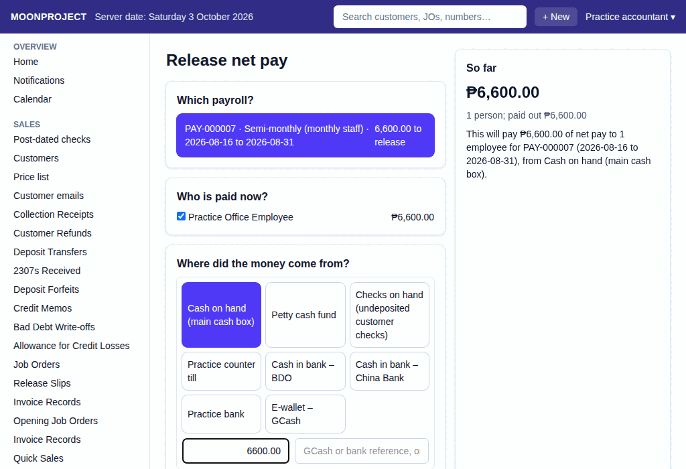

# 6. Payroll and Release Pay

**What it is for:** Work out the payroll for a period, deduct cash advances, and then release the net pay to the employees.

**Before you start:** Make sure all production work for the period is recorded so the piece-rate pay is pulled correctly.

### Steps for the Payroll Run
1. On the **People & Payroll** menu, click **Payroll Runs**.
2. Click **+ New**.
3. Pick the **Pay group** and the **Period**. The system will automatically show the pay worked out for everyone.
   
4. If an employee is taking a cash advance deduction, type the amount in the **cash-advance deduction** box.
5. If you need to skip an employee for now, click **Leave out**. (You can put them back if you change your mind).
6. Click **Record**.

### Steps for the Release
1. On the **People & Payroll** menu, click **Payroll Releases**.
2. Click **+ New**.
3. Pick the payroll run you just recorded.
4. Tick the checkbox next to the employees you are paying right now.
   
5. Click **Record**.

### What the system does for you
It automatically calculates SSS, PhilHealth, Pag-IBIG, and tax (if applicable). It pulls the piece-work pay directly from the production records, so you never have to type it twice. When you release the pay, it updates the cash balances automatically.

### Common mistakes and how to fix them
- **Mistake:** You realized the piece work was wrong after recording the payroll run.
- **Fix:** Never delete the record. First, cancel any releases you made for that run. Then, view the payroll run and cancel it. Fix the production records, and then make a new payroll run.
