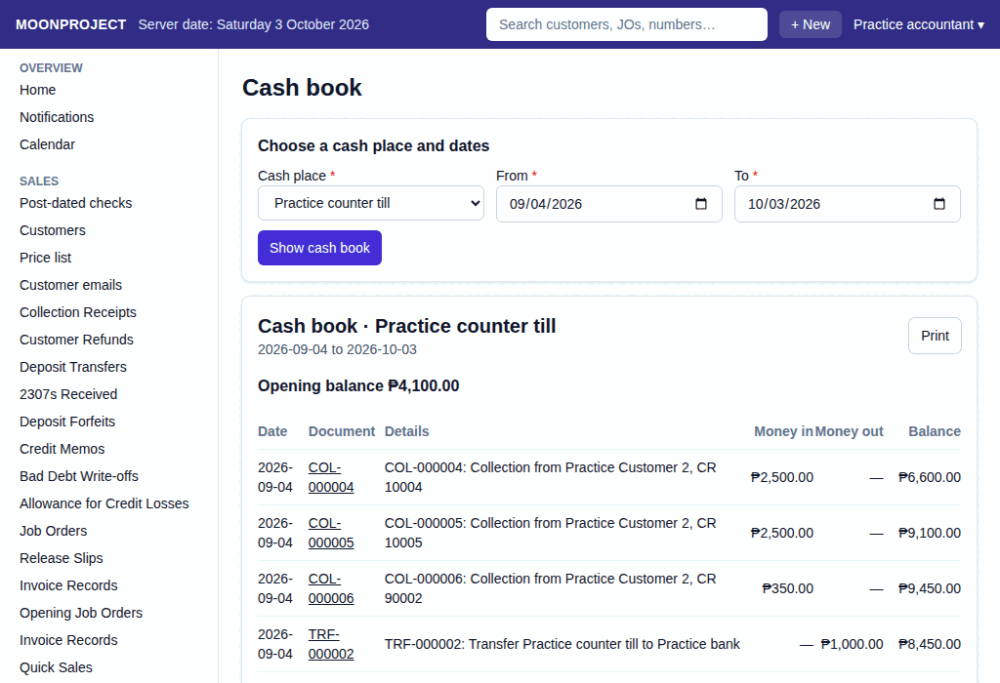

# 8. Cash Book

**What it is for:** View the daily movements of money in and out of a specific cash box, bank account, or e-wallet over a period of time, and see the running balance.

**Before you start:** You will need to know which cash place you want to look at and the date range you are interested in.

### Steps
1. On the **Money** menu, click **Cash book**.
2. Under **Choose a cash place and dates**, pick the **Cash place** from the list.
3. Type the **From** and **To** dates.
4. Click **Show cash book**.
   

### What the system does for you
It calculates the opening balance at the start of your chosen dates. Then, it lists every document (like collections, payments, or counts) that moved money in or out during that time, showing a running balance after each one. It finishes with the closing balance. You can click on the document numbers to see the original record. You can also print the cash book by clicking the **Print** button.

### Common mistakes and how to fix them
- **Mistake:** You cannot see the cash place you want to look at in the list.
- **Fix:** Check that the place exists and is active. Encoders now have the accountant's access to balances by default. If a place is still missing, ask the owner to check your permissions on **Roles and permissions**.
