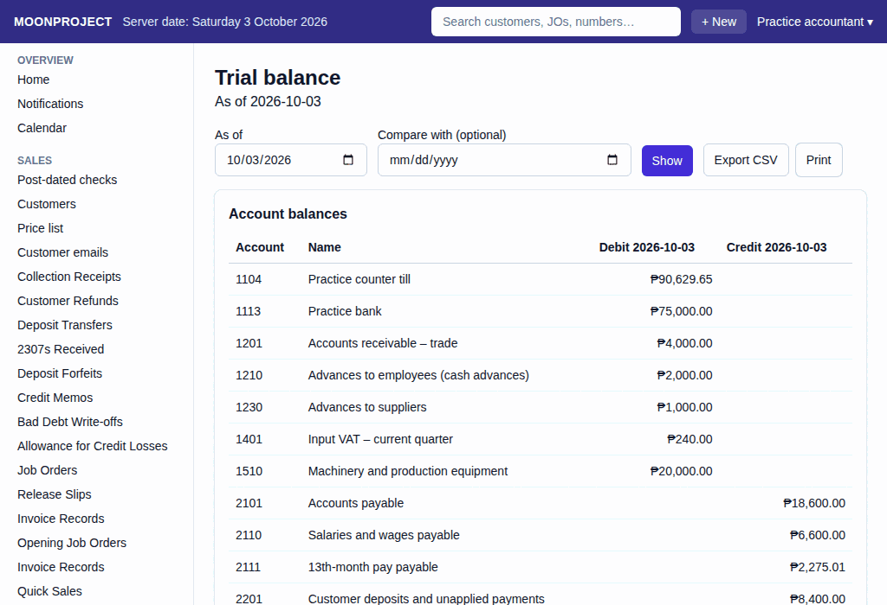

# 9. Books and Reports

**What it is for:** View the full accounting records of the business: the General journal, General ledger, and Trial balance.

**Before you start:** Know which report you want to see and the dates you are interested in. *Note: Only the accountant and the owner have access to these reports.*

### Steps
1. On the **Reports** menu, choose the report you want:
   - **General journal:** To see a chronological list of every accounting entry.
   - **General ledger:** To see the movements and running balances of each individual account.
   - **Trial balance:** To see a snapshot of all account balances on a specific date.
2. For the General journal and General ledger, choose the **From** and **To** dates.
3. For the General ledger, you can optionally pick a specific **Account** to filter the results.
4. For the Trial balance, choose the **As of** date. You can also pick a **Compare with (optional)** date to see changes between two periods.
5. Click **Show**.
   

### What the system does for you
It automatically builds the accounting reports from all the documents and transactions recorded in the system. The reports update instantly as new records are saved. You can click on the source document numbers in the journal or ledger to see exactly where the entry came from.

To save the information to your computer, click **Export CSV**. This downloads a file you can open in Excel or other spreadsheet programs. You can also click **Print this page** to print the report directly from your screen.

### Common mistakes and how to fix them
- **Mistake:** You cannot find the reports on the menu.
- **Fix:** Access to the books is strictly limited. If you are an encoder, you will not see these options. Only users with the accountant or owner roles can open the reports.
