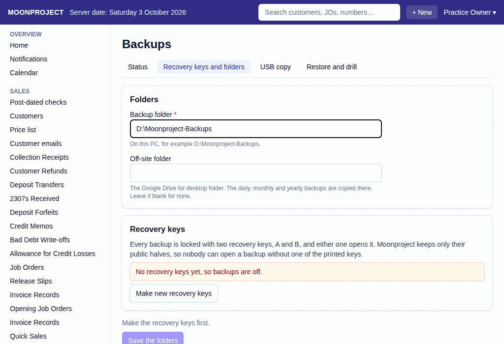

# 11. Backups

**What it is for:** Set up the recovery keys needed to unlock your system's backups, tell the system where to save backups, and make copies of your backups to a USB drive.

**Before you start:** You will need a printer to print your new recovery keys. Know the folder on the server PC (the computer Moonproject runs on) where you want to keep the backups, and have an off-site folder ready (like a Google Drive for desktop folder) if you want to keep copies there. You should also have two USB flash drives, Drive A and Drive B, to swap out weekly. The USB drive goes into the server PC.

### Steps
1. On the **Admin** menu, click **Backups**.
2. Click the **Recovery keys and folders** tab.
3. Type the **Backup folder** where you want to save backups on the server PC.
   
4. If you have an **Off-site folder**, type its location too.
5. Click **Make new recovery keys**. The system will show you two keys, Key A and Key B.
6. Click **Print key A** and **Print key B**, or write the keys down exactly. Keep Key A with you (the owner) and seal Key B in a safe place away from the shop.
7. To prove you saved them, look at the printed sheets and type the **Last 8 characters of key A** and the **Last 8 characters of key B** back into the screen.
8. Click **Save the folders and the new keys**.
9. Type your password in **Enter your password again to continue** and click **Continue**.
10. To make a USB copy, plug your USB drive (either Drive A or Drive B) into the server PC.
11. Go to the **Admin** menu, click **Backups**, and go to the **USB copy** tab.
12. Choose the **Drive** you are using (**Drive A** or **Drive B**).
13. Type the **Folder on the drive** where you want to save the backup (for example, `E:\Moonproject-Backups`).
14. Click **Copy to drive A** (or **Copy to drive B**).
15. Unplug the drive and take it away from the shop. Next week, swap it for the other drive.

### What the system does for you
It keeps your backups completely locked. Without one of your printed recovery keys, nobody can open your backups. It runs automatic backups (daily, monthly, and yearly) and tells you the status on the **Status** tab. When you make a USB copy, the system automatically adds the new backups that the drive does not have yet.

### Common mistakes and how to fix them
- **Mistake:** You threw away old recovery keys after making new ones, but you still have yearly backups that were locked with the old keys.
- **Fix:** Do not throw away old recovery keys until you no longer need any backups that were locked with them. Yearly backups are kept forever, so you should keep the old keys as long as you keep those yearly backups.
- **Mistake:** The **Status** tab warns you that backups are stale.
- **Fix:** This means no backup has worked for a while. The **Status** tab's **Last runs** table gives the reason each backup failed. Fix that, then click **Back up now** to check. Also note that with no recovery keys, backups are off.
