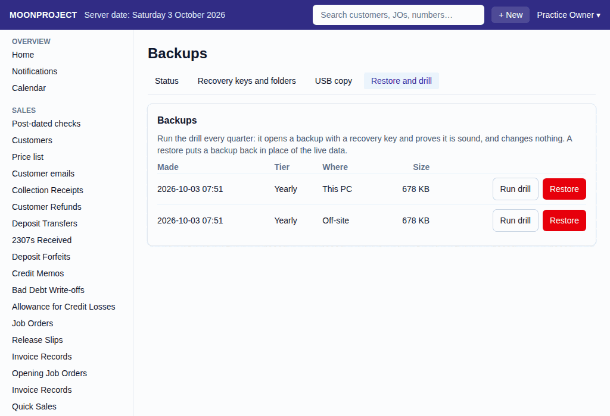

# 12. Restore from a Backup

**What it is for:** Prove your backups work by running a test (a "drill") every quarter, or put a backup back into the live system if something goes wrong.

**Before you start:** Do this in the real shop (no yellow "PRACTICE SHOP" band at the top). The practice shop has no backups, so there the screen says "Backups and restores are not part of the practice shop." Have your printed Recovery Key A or Key B ready. The system will not let you open any backup without typing one of them. For a drill, nothing changes in the system. For a real restore, know that anything typed into the system after the backup was made will be lost.

### Steps
1. On the **Admin** menu, click **Backups**.
2. Click the **Restore and drill** tab.
   
3. You will see a list of backups. Pick one and click **Run drill** (or **Restore** for emergencies).
4. Type your **Recovery key A or B** exactly as printed on your sheet.
5. Click **Open the backup**.
6. Type your password in **Enter your password again to continue** and click **Continue**.
7. If you ran a drill, the system checks that the backup is completely sound, changes nothing in your live data, and records that you successfully did your drill.
8. If you chose Restore, the system checks the backup and shows you exactly what you will lose if you continue. For each document series it shows the last number now and the last number in the backup: the numbers issued after the backup will be issued again to new documents, so mark or set aside any printed or sent copies with those numbers. The current data is kept safe for now.
9. To confirm the restore, type RESTORE in capital letters in **Type RESTORE to go ahead**.
10. Click **Restore this backup**.
11. Type your password in **Enter your password again to continue** and click **Continue**.
12. Everyone should save their work and sign out first, then restart Moonproject to finish the restore.

### What the system does for you
It keeps your backups completely safe by asking for the recovery key, and it prevents you from making a mistake by holding the live data to the side while you check the backup. It shows you the trial balance and how many documents are in the backup, so you know exactly what you are restoring.

### Common mistakes and how to fix them
- **Mistake:** You typed your recovery key, but the system says it is wrong.
- **Fix:** Correct the key in the box (spaces and small letters do not matter) and click **Open the backup** again. If it still does not open, try the other key. The system never saves your key, so you must get it right.
- **Mistake:** You changed your mind about restoring a backup after clicking **Open the backup**.
- **Fix:** Change your mind before clicking **Restore this backup**: click **Back to the list**, and nothing changes. The system allows 30 minutes between opening the backup and clicking **Restore this backup**. Once **Restore this backup** is clicked, nothing in the app takes it back, and the restore happens at the next restart.

### Numbers issued again after a restore

**What it is for:** Avoid mistaking an old printed copy for a new document after restoring an earlier backup.

**Before you start:** Stop recording and have the owner and accountant compare the backup with the live shop. Keep the latest backups and printed or sent copies.

**Steps:**
1. Follow **Restore and drill** > **Restore** > **Open the backup** above.
2. Before confirming, read **Series**, **Last number now**, **Last in the backup** and **Issued again**.
3. Mark or set aside the affected printed and sent copies. Tell staff which numbers are affected.
4. Only after the loss and reused numbers are understood, type RESTORE and use **Restore this backup**. Everyone signs out before the restart.

**What the system does:** The backup restores the earlier number counters as well as the books. Numbers issued since the backup can be issued again to new documents. The current data is kept next to the restored data.

**Common mistakes:** **Run drill** checks the backup without replacing the live shop. Do not choose **Restore** just to test a backup. Before confirmation, **Back to the list** leaves the live data alone; after confirmation there is no in-app undo.
