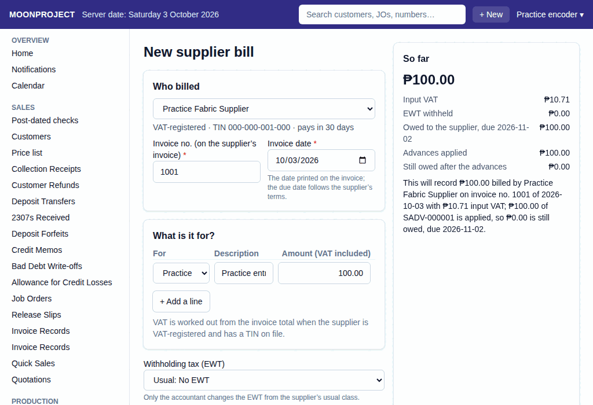
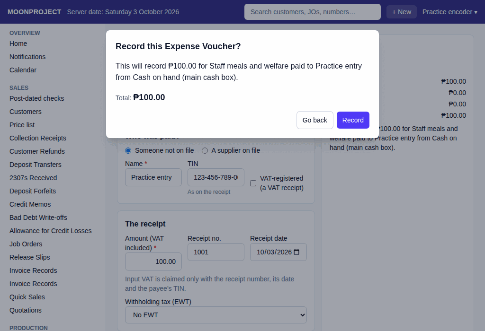

# 13. Bills and Expenses

**What it is for:** Record a bill from a supplier, pay it later, or record an expense paid right away.

**Before you start:** Know who you are paying and have the invoice or receipt ready. The supplier must already be on file.

### Steps

**To record a supplier bill:**
1. On the **Purchases & Expenses** menu, click **Supplier Bills**.
2. Click **+ New Supplier Bill**.
3. Pick the supplier.
4. Type the **Invoice no. (on the supplier’s invoice)** and pick the **Invoice date**.
5. Pick what it is **For** and type a **Description**.
6. Type the **Amount (VAT included)**.
   
7. Click **+ Add a line** if there are more items, or **Remove** to delete one.
8. The **Tax withheld from supplier (EWT)** is set to the supplier's usual class, and users with permission to change EWT can change it. Owners, accountants and encoders have this access by default; follow the accountant's instructions.
9. Add a **Note** if needed.
10. Click **Record**. Check what the app shows in **Record this Supplier Bill?**, then click **Record** again.

**To pay supplier bills:**
1. On the **Purchases & Expenses** menu, click **Supplier Payments**.
2. Click **+ New Supplier Payment**.
3. Pick the supplier.
4. Under **Pay now**, type the amount to pay for each bill, or click **Pay remaining** to fill in the amount still owed.
5. Under **Where did the money come from?**, pick the cash place.
6. Type the **Bank fee** if the bank charged a transfer fee.
7. Add a **Note** if needed.
8. Click **Record**. Check what the app shows in **Record this Supplier Payment?**, then click **Record** again.

**To record an expense paid now:**
1. On the **Purchases & Expenses** menu, click **Expense Vouchers**.
2. Click **+ New Expense Voucher**.
3. Pick the **Expense** and type a **Description**.
4. Under **Who was paid?**, pick **Someone not on file** or **A supplier on file**.
5. If someone not on file, type the **Name**, **TIN**, and check **VAT-registered (a VAT receipt)** if it is. If a supplier on file, pick the supplier.
6. Type the **Amount (VAT included)**.
7. Type the **Receipt no.** and pick the **Receipt date**.
8. Pick the **Tax withheld from supplier (EWT)** class only when the payee's tax requires it; the usual class is filled in.
9. Under **Where did the money come from?**, pick the cash place.
10. Click **Record**. Check what the app shows in **Record this Expense Voucher?**, then click **Record** again.
    

### What the system does for you
It records what you owe and when you pay it. The receipt number, its date, and the payee's TIN claim the input VAT. VAT is worked out for you when the supplier is VAT-registered and has a TIN on file. The due date follows the supplier's terms. EWT is taken off what is owed when the bill is recorded, so a payment has no EWT.

### Common mistakes and how to fix them
- **Mistake:** You entered the wrong amount.
- **Fix:** You cannot delete recorded documents. Open the document and click **Edit** (this asks for a reason, cancels the old one, and records the replacement under a new number), or click **Cancel** with a reason of at least 10 characters. A bill that has payments cancels only after them: the app will warn you to cancel the payments first.

### Printed dates on bills and vouchers

**What it is for:** Record the PRINTED DATE from the booklet or paper document, including when you type it later.

**Before you start:** Have the paper in front of you. The date must be real, today or earlier, and outside a month the accountant has signed off.

**Steps:**
1. Fill **Date to record it on** on a bill, or **Date on the voucher** on an expense voucher with the date printed on the paper. Leave it empty only when that date is today.
2. On a bill, also fill **Invoice date** from the supplier's invoice. On a voucher, **Receipt date** is the date of the supporting receipt; it is separate from the voucher's printed date.
3. Click **Record**, check the date and amounts, then click **Record** again.

**What the system does:** The recorded document and its journal use this date; its VAT goes to that month. The app still keeps when it was entered. It refuses a future date, an impossible date, or a date in a signed-off month.

**Common mistakes:** "Type the date printed on the document like 2026-09-30, or leave it empty for today." means check the day, month and year. "The date printed on the document cannot be after today (...)" means check the paper and the shop PC's date. "... is already signed off at month-end, so nothing new is dated ..." means stop and ask the accountant; do not change the true date just to get past it.

### A duplicate supplier invoice

**What it is for:** Stop the same supplier invoice being recorded twice, while allowing an explained exception.

**Before you start:** Search the supplier's bills and expense vouchers and compare the paper. Going ahead needs the permission to backdate, given by default to owners, accountants and encoders. Follow the accountant's decision.

**Steps:**
1. Fill the bill or voucher and click **Record** to check it.
2. If it is a duplicate, open the existing record named by the refusal. If it is the same purchase, stop: do not record it again.
3. If the accountant confirms a genuine exception, fill **Reason to go ahead anyway** with 10 to 200 characters.
4. Click **Record** again, review the figures and reason, and confirm with **Record**.

**What the system does:** The reason box appears after the duplicate refusal, only for someone with permission. The next check and recording carry the reason, which is kept with the document.

**Common mistakes:** Do not change the invoice number to hide a duplicate. If the box does not appear, ask the accountant or owner to handle the exception.
