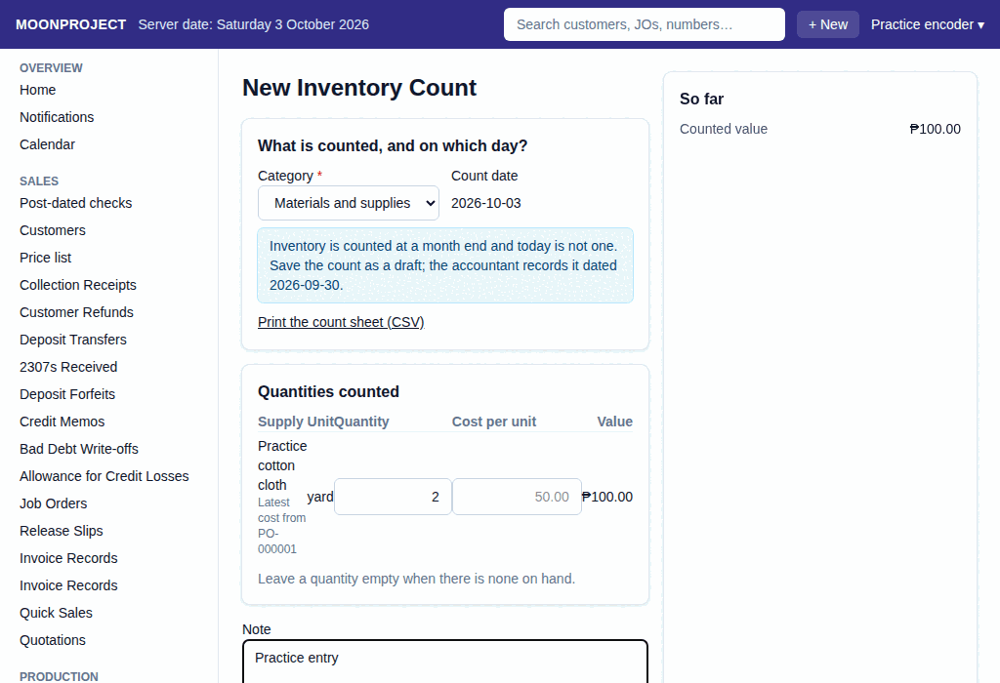

# 15. Inventory Count

**What it is for:** Print a sheet to write down what you have, count your materials or ready-made goods at a month end, and type the count to match the books to the physical inventory.

**Before you start:** You will need to print the count sheet to record your quantities before typing them in. Count on the last day of the month and record it that day. On a later day, click **Save draft** and ask the accountant to record it.

### Steps
1. On the **Purchases & Expenses** menu, click **Inventory Counts**.
2. Click **+ New Inventory Count**.
3. Choose the **Category** (**Materials and supplies** or **Ready-made merchandise**).
4. Check the **Count date**.
5. Click **Print the count sheet (CSV)** to download and print the list, then go count the physical items.
6. Back in the system, type the **Quantity** you counted for each item. Leave a quantity empty when there is none on hand.
   
7. The **Cost per unit** is the latest purchase cost; you can change it if needed, but you must type a reason why it is not the latest purchase cost.
8. Add a **Note** if needed.
9. Click **Record**. Check what the app shows in **Record this Inventory Count?**, then click **Record** again. (Or click **Save draft** to finish later.)

### What the system does for you
It calculates the total value of what you counted. If there is a difference, the adjustment increases or decreases the books to match what you actually counted.

### Common mistakes and how to fix them
- **Mistake:** You entered the wrong quantity or cost for an item.
- **Fix:** You cannot delete a recorded count. To fix a mistake, just cancel and redo it. You can open the count and choose to edit it, which will ask for a reason, cancel the old count, and let you record a new one with the correct quantities.
- **Mistake:** The system says "The count matches the books ..., so there is nothing to adjust."
- **Fix:** You do not need to record a count if nothing changed from what is already in the books.
- **Mistake:** The system says a count for that category and date is already recorded.
- **Fix:** You can only have one count per category on the same date. Open the existing count and edit it instead.
