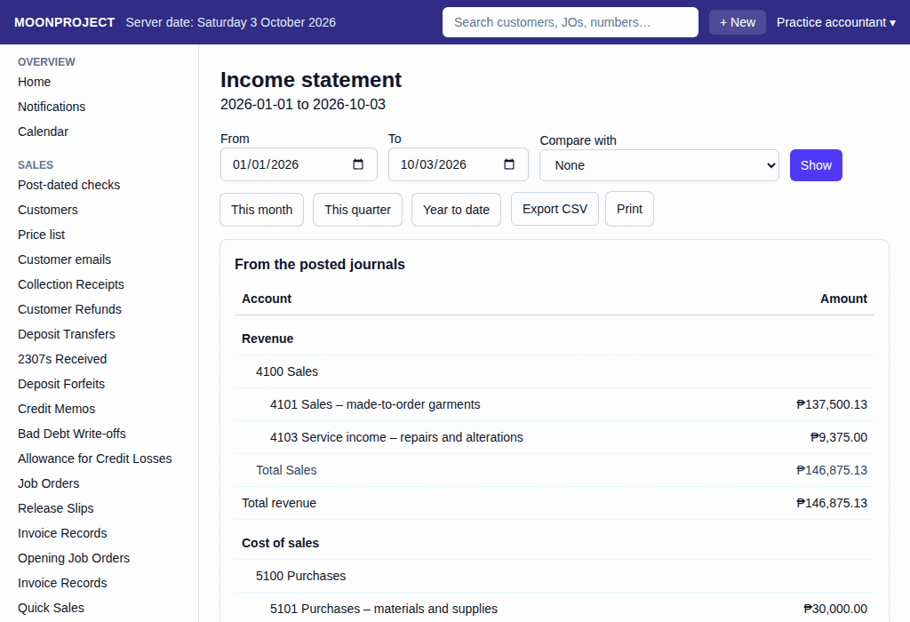
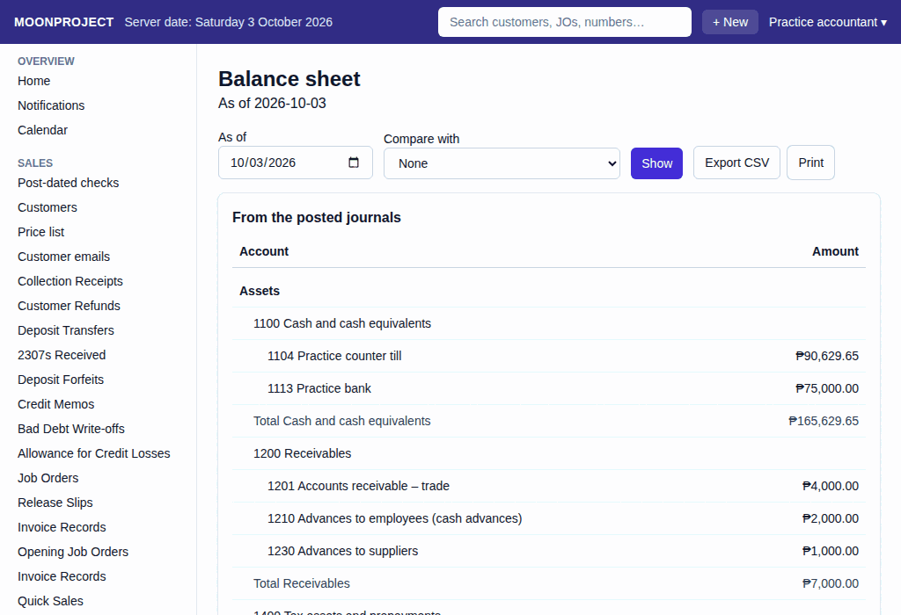

# 16. Income Statement and Balance Sheet

**What it is for:** View how much money the business made or lost, and see what the business owns and owes.

**Before you start:** Know the dates you want to check. *Note: Owners, accountants and encoders have access to these reports by default.*

### Steps
1. On the **Reports** menu, choose **Income statement** or **Balance sheet**.
2. To open the Income statement for a month or a year, choose the **From** and **To** dates, or click **This month**, **This quarter**, or **Year to date**.
   
3. To open the Balance sheet on a date, choose the **As of** date.
   
4. Click **Show**.

### What the system does for you
It automatically builds the statements from the posted journals.

The Income statement shows your business performance: Revenue is your sales. Cost of sales is the direct cost to make your goods. Gross profit is the money left after making the goods. Operating expenses are the everyday costs to run the business. Net income is your final profit.

On the Balance sheet, current-year earnings are the net income from the start of the year to your chosen date, while opening balance equity is a setup account that only shows while it is not zero. A balance check line at the bottom tells you if total assets equal total liabilities and equity.

The **Statement of changes in equity** (on the **Reports** menu) shows how your equity moved. Pick the **From** and **To** dates and click **Show**, or click **This month**, **This quarter** or **Year to date**. The rows start with the balance at the start, then **Profit or loss for the period**, **Dividends declared**, and **Owners’ money put in and taken out**, and end with the balance at the **To** date. The **Total equity** column at the end agrees with total equity on the balance sheet.

To save the information to your computer, click **Export CSV**.

### Common mistakes and how to fix them
- **Mistake:** You cannot find the statements on the menu.
- **Fix:** Owners, accountants and encoders can open these reports by default. If a report is missing, ask the owner to check **Roles and permissions**.
- **Mistake:** You want to fix a wrong amount on the statement by deleting a record.
- **Fix:** You cannot delete records in the system. Fix mistakes by canceling and redoing the incorrect document.