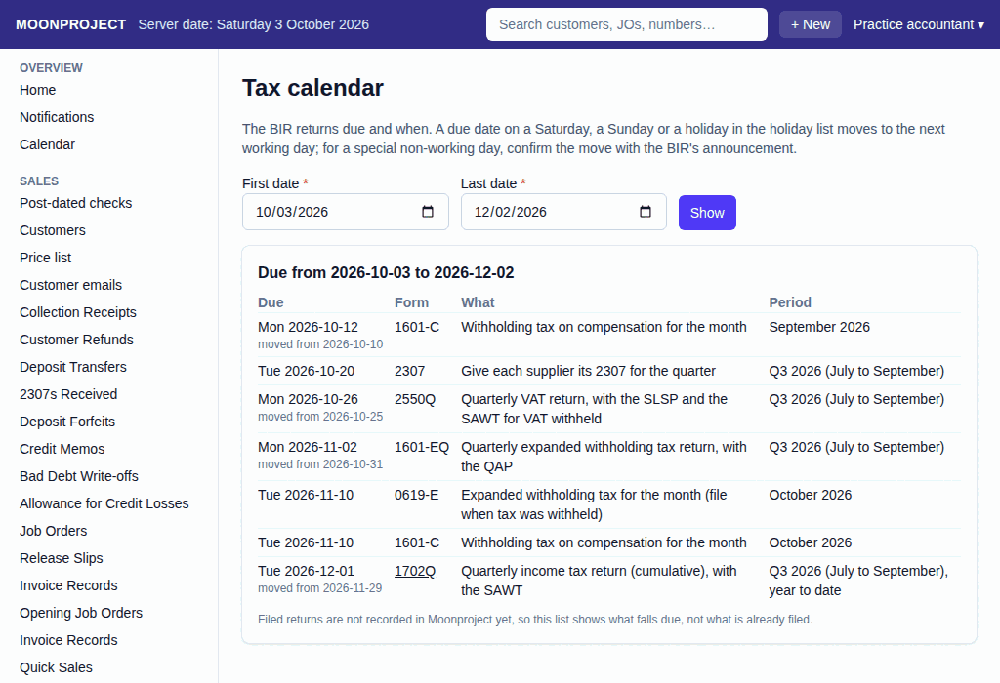
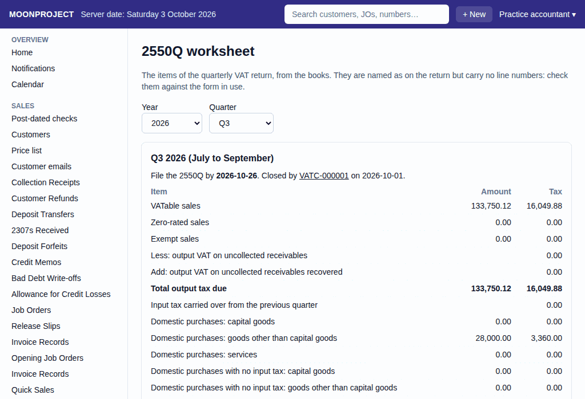

# 18. BIR payments

**What it is for:** Know what tax returns are due, close the VAT at the end of a quarter, and record the payments made for the 2550Q, 0619-E, and 1601-EQ.

**Before you start:** Know that the system tracks due dates for you, taking weekends and holidays into account. You will need the payment details (amount, penalty, reference) when you record a BIR payment.

### Steps
1. **Check what is due:**
   - On the **Accounting & Tax** menu, click **Tax calendar**. Here you will see a list of what falls due and when.
     
2. **Close the VAT (at quarter end):**
   - When a quarter ends, go to the **2550Q worksheet** on the **Accounting & Tax** menu.
     
   - Click the **Record the VAT close of Q...** button.
   - Pick the **Year** and **Quarter**, and optionally choose the **Date of the close** (the quarter's last day or today).
   - Click **Record**.
3. **Record a BIR payment:**
   - Open the worksheet of the return you paid: **0619-E (monthly EWT)** for the first or second month of a quarter, **1601-EQ (quarterly EWT)** for a quarter, or **2550Q worksheet** for the VAT.
   - Click **Record BIR payment**.
   - Fill in the **Return**, **Year**, and **Month** or **Quarter**.
   - Pick **Where did the money come from?**.
   - Type the **Amount paid**, any **Penalty** paid on top, and the eFPS, eBIRForms or bank **Reference**.
   - You may also add an optional **Note**.
   - Click **Record**.

### What the system does for you
The tax calendar automatically shifts due dates that fall on weekends or holidays to the next working day. When you open a tax worksheet, the system automatically calculates the tax still payable or left to pay. When you record a BIR payment from a worksheet, the system links the payment to the exact return and period, reducing the amount left to pay in the system.

### Common mistakes and how to fix them
- **Mistake:** You recorded a BIR payment with the wrong amount, date, or reference.
- **Fix:** Do not delete the payment. Open the wrong payment, cancel it, and redo it by recording a new payment with the correct details.
