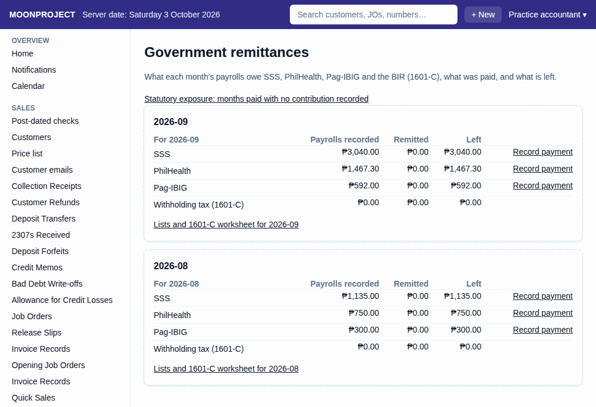

# 21. Government Remittances

**What it is for:** See the monthly contributions and taxes you owe, and record when you pay the agencies.

**Before you start:** Complete the month's payrolls first. If you are recording a payment, you need the physical receipt or proof of payment from the agency.

### Steps
1. On the **People & Payroll** menu, click **Government remittances**.
   
2. Click **Lists and 1601-C worksheet for {month}** to see the details of a specific month.
3. This screen shows the **SSS contributions list**, **PhilHealth list**, **Pag-IBIG list**, and **1601-C worksheet**.
4. In those lists, the **Employee share** is the money you deducted from your employees' pay. The **Company share** is the extra money the business pays for them.
5. Pay the agency using their official channels.
6. To record that you paid, go back to the **Remittance check** panel or the main **Government remittances** screen, and click **Record payment**.
7. Under **What is paid?**, choose who you **Paid to** and check the **For the month**.
8. Under **Where did the money come from?**, choose the cash box or bank account you used.
9. Type the **Amount paid**. If you paid the exact amount owed, you can click **Pay all of it**.
10. If you paid a **Late-payment penalty**, type it in. This is separate from the regular amount.
11. Type the **PRN, reference or receipt no.** from your proof of payment.
12. If you are recording this days after you actually paid, fill in the **Date paid**.
13. Add a **Note** if needed.
14. Click **Record**.

### What the system does for you
It calculates exactly how much you owe SSS, PhilHealth, Pag-IBIG and the BIR based on the payrolls you recorded. When you record a payment, it checks if you paid the right amount and deducts it from the money you owe. If you pay less than the total, it will spread the payment and keep the rest as payable.

### Common mistakes and how to fix them
- **Mistake:** You remitted less than what the system says you owe.
- **Fix:** If you missed an employee or a payroll run, record that missing payroll first. If the payrolls were right but you just paid short, the system will warn you and keep the remaining balance as payable.
- **Mistake:** You remitted more than what the system says you owe.
- **Fix:** The system will stop you and show an error. Find the difference first. Usually, this means a payroll run is not recorded yet. Record the missing payroll, then try again. If there are extra amounts for other reasons, the accountant handles them.
- **Mistake:** You typed the wrong amount or chose the wrong cash place.
- **Fix:** You cannot change a recorded remittance. To fix it, you must cancel and redo it. Open the remittance, click **Cancel**, and then record a new one with the correct details.
