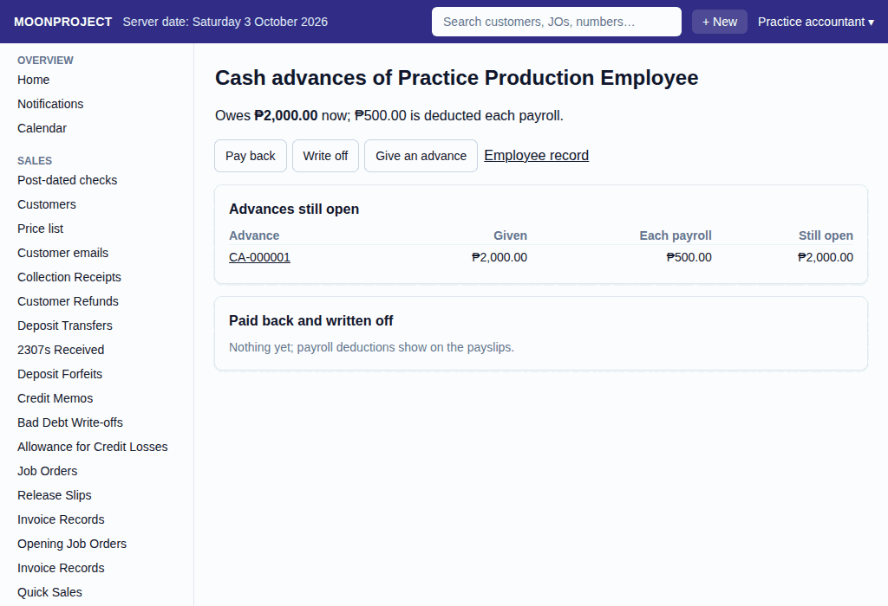

# 22. Cash Advances

**What it is for:** Give cash advances to employees, set how much is deducted per payroll, record if they pay back in cash, and write off balances if needed. You can also view what each employee still owes.

**Before you start:** Know exactly who the employee is, the amount they are getting or paying back, and for write-offs, the reason and expense account to charge it to. Only those with permission (like accountants) can record a write-off.

### Steps

**To give an advance:**
1. On the **People & Payroll** menu, click **Cash advances owed**.
2. Click the name of the **Employee**.
   
3. Click **Give an advance**.
4. Choose the employee and the cash place where the money came from.
5. Type the **Amount** and the amount **Deducted each payroll**.
6. Click **Record**.

**To record a payback in cash:**
1. On the **People & Payroll** menu, click **Cash advances owed**.
2. Click the name of the **Employee**.
3. Click **Pay back**.
4. Choose the employee and the cash place where the money went.
5. Type the **Amount** they paid.
6. Click **Record**.

**To write off a balance:**
1. On the **People & Payroll** menu, click **Cash advances owed**.
2. Click the name of the **Employee**.
3. Click **Write off**.
4. Choose the employee and leave the amount blank to write off all that is owed, or type a specific amount.
5. Choose the expense account to **Charge to** (usually 6990 Miscellaneous, or salaries if treated as pay).
6. Type why it is written off.
7. Click **Write off**.

### What the system does for you
It keeps track of the running balance each employee owes on cash advances. The payroll automatically deducts the amount per payroll you set until the advance is fully paid, showing the deductions clearly on their payslips. When you write off an advance, the system warns you that a forgiven cash advance counts as the employee's taxable pay for the year. It also keeps a clear history of "Advances still open" and "Paid back and written off".

### Common mistakes and how to fix them
- **Mistake:** You recorded a cash advance with the wrong amount or deduction per payroll.
- **Fix:** Do not try to delete it, as records cannot be deleted. Instead, open the cash advance, edit it to the correct amounts, and provide a reason. The system will cancel the wrong record and issue a correct one.
