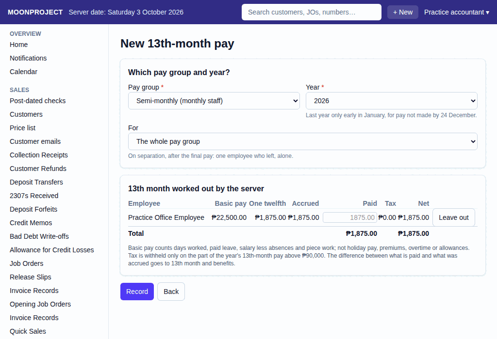

# 23. 13th-Month Pay

**What it is for:** Work out and record the 13th-month pay, which must be given to employees on or before 24 December, and release the net pay.

**Before you start:** Make sure all payroll runs for the year up to the cut-off are recorded.

### Steps for the 13th-Month Pay
1. On the **People & Payroll** menu, click **13th-Month Pay**.
2. Click **+ New**.
3. Pick the **Pay group** and the **Year**. The system will automatically work it out.
   
4. Check each employee's **To pay now** amount. Open **Calculation and deductions** to compare **One twelfth** with **Accrued** and see the tax deduction.
5. If you need to change an amount, open **Change this amount** and type it in **13th-month amount** and type a reason in the **Why the amount is changed** box. For 2026 only, pay before the shop started using Moonproject is not in its payroll runs. You must change each employee's amount to the full 13th-month pay and add a note such as "includes pay before Moonproject".
6. To skip someone, click **Leave out** and type a reason in the **Why (their runs stay for a later 13th-month pay)** box. (You can put them back by clicking **Put back**).
7. If you change your mind about an amount, click **Use one twelfth**.
8. Click **Record**.

### Steps for the Release
1. View the recorded 13th-month pay.
2. Click **Release net pay**.
3. Tick the checkbox next to the employees you are paying right now.
4. Click **Record**.

### What the system does for you
It calculates one twelfth of each employee's basic pay from the recorded payroll runs for the year. It checks what was accrued in previous payrolls. Tax is withheld only on the part of the year's 13th-month pay above ₱90,000. When you release the pay, it updates the cash balances automatically.

### Common mistakes and how to fix them
- **Mistake:** You realized an amount was wrong after recording the 13th-month pay.
- **Fix:** Never delete the record. First, cancel any releases you made for that run. Then, view the 13th-month pay and cancel it. Work it out again by making a new 13th-month pay.
