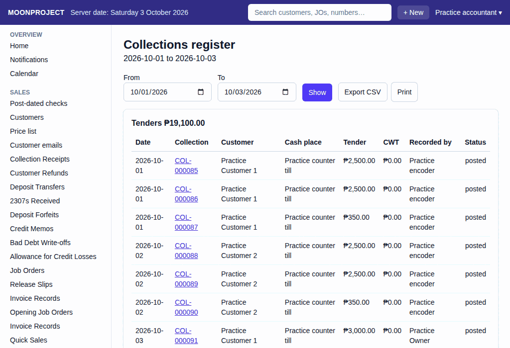

# 26. Sales and Collections Reports

**What it is for:** View your sales, collections, deposits, and the status of your job orders.

**Before you start:** Know the dates you want to check. *Note: Owners, accountants and encoders have access to these reports by default.*

### Steps
1. On the **Reports** menu, choose **Deposits held**, **Collections register**, **Sales by period**, or **Job order follow-up**.
   
2. If the report needs dates, choose the **As of** date, or choose the **From** and **To** dates.
3. Click **Show**.
4. To view the source record for an entry, click the document number on a row to open it.

### What the system does for you
It automatically builds the reports from your saved records.

Each report helps you track your business:
- **Deposits held:** Shows money held for customers.
- **Collections register:** Shows all money received. It totals the amounts **By cash place** and **By recorder**.
- **Sales by period:** Shows your net sales. It breaks down the amounts **By period**, **By customer**, **By item**, and **By garment type**.
- **Job order follow-up:** Tracks the progress of your orders. It groups them **By status** and lists all **Job orders**. It also highlights orders **Released with a balance** and **Release records awaiting invoice**.

To save the information to your computer, click **Export CSV**.

### Common mistakes and how to fix them
- **Mistake:** You cannot find the reports on the menu.
- **Fix:** Owners, accountants and encoders can open these reports by default. If a report is missing, ask the owner to check **Roles and permissions**.
- **Mistake:** You want to fix a wrong amount on a report by deleting a record.
- **Fix:** You cannot delete records in the system. Fix mistakes by canceling and redoing the incorrect document.
