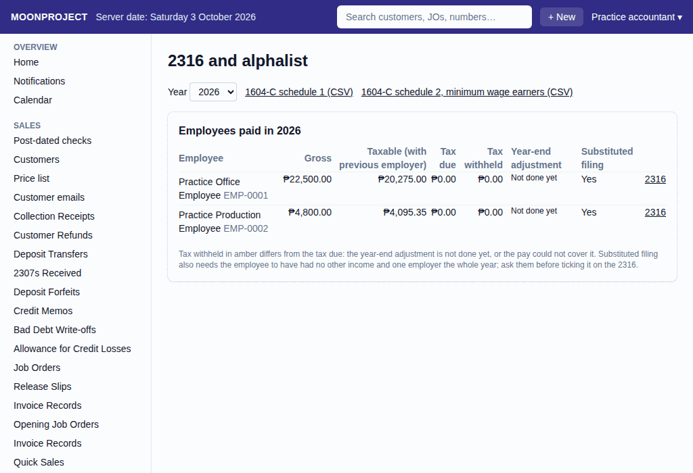

# 28. Year-end tax and 2316

**What it is for:** Add a previous employer's pay and the pay before Moonproject. Do the year-end tax adjustment on the last payroll. See what needs a substituted filing. Download the 2316 data sheet and the 1604-C alphalist.

**Before you start:** Make sure all payroll runs and 13th-month pay for the year are recorded. The accountant adds the previous pay on the employee's page. Under **Pay before Moonproject and from previous employers**, type the **Year** (for example 2026). On the **Paid by** menu, pick either **This shop, before Moonproject** or **Previous employer (from its 2316)**. Choosing the previous employer adds a required **Previous employer** field and an optional **Its TIN** field. Fill in the gross, the non-taxable parts, and the tax withheld. Click **Save**.

### Steps for the year-end adjustment
1. On the **People & Payroll** menu, click **Payroll Runs**.
2. Click **+ New Payroll Run**.
3. Pick the **Pay group** and the **Period** first.
4. If the period ends in December, a tick box appears. Tick the **Year-end tax adjustment** box.
5. In the preview, each employee's **Tax** cell says "Refund ₱…" or "Deficiency ₱… withheld". The **Tax refund** column appears only after it is recorded.
6. Click **Record**.

### Steps for the 2316 and alphalist
1. On the **People & Payroll** menu, click **2316 and alphalist**.
   
2. Pick the **Year**.
3. It shows if an employee needs **Substituted filing**.
4. Click **2316** next to an employee. It opens a page called **2316 data**. Click **Print**.
5. Click **1604-C schedule 1 (CSV)** or **1604-C schedule 2, minimum wage earners (CSV)** to download the files for the BIR data entry.

### What the system does for you
When you tick **Year-end tax adjustment**, it compares the year's tax due to what was already withheld. A deficiency is withheld from the net pay as far as the pay allows. An excess shows as **Add year-end tax refund** on the payroll run and the payslip. An employee qualifies for substituted filing if they had one employer for the whole year and the tax withheld equals the tax due. It then shows **Yes** under **Substituted filing**.

### Common mistakes and how to fix them
- **Mistake:** You recorded a payroll run or a 13th-month pay after you did the year-end adjustment. The new pay is not in the year's total.
- **Fix:** Cancel the new payroll run or 13th-month pay. Then view the December payroll run with the adjustment and cancel it too. Redo the December payroll run and tick the **Year-end tax adjustment** box again.
