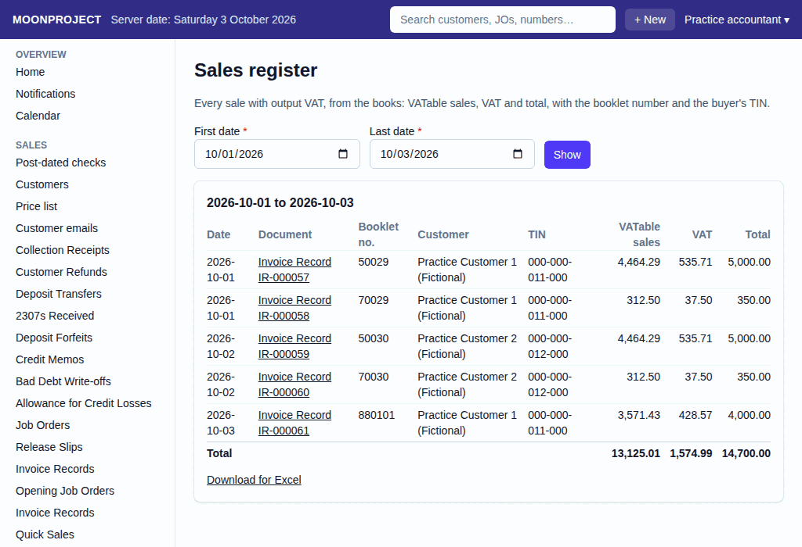
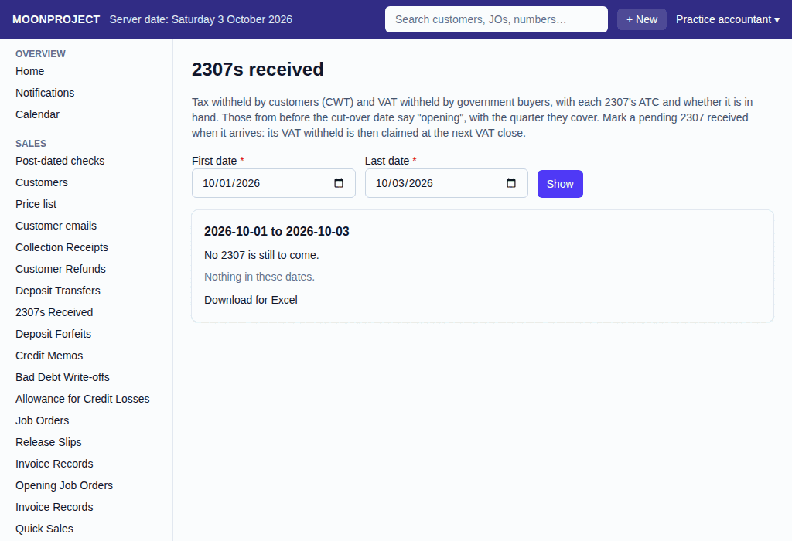

# 29. VAT each quarter

**What it is for:** Check the sales and purchases, mark the tax certificates (2307s) received, preview the VAT for the quarter, check the 2550Q worksheet, and close the VAT at the end of the quarter. The accountant normally closes the VAT.

**Before you start:** The system calculates the VAT from your daily work. The worksheet will warn you if any journal vouchers on input VAT still need classifying. The accountant must classify them before filing. Have your physical 2307s ready if you received them.

### Steps
1. **Check the sales and purchases registers:**
   - On the **Accounting & Tax** menu, click **Sales register** to see all sales with output VAT and the **Total**.
     
   - Go to the **Purchases register** to see all purchases with input VAT, broken down **By class** (**Amount before VAT**, **Input VAT**, and **Total**).
   - If a purchase shows **Class** as "To classify", the accountant must classify these journal vouchers into capital goods, goods, or services before filing.
2. **Mark the 2307s received:**
   - On the **Accounting & Tax** menu, click **2307s received**.
     
   - Find the physical 2307 certificate from your customer.
   - Click **Mark received** next to the matching row. The button shows only on rows still open. This opens a "Mark the 2307 received" box.
   - Check the row details carefully. Click its **Mark received** button to confirm. Or click **Back** to cancel. The box says it cannot be undone. Its VAT withheld will be claimed at the next VAT close.
3. **View the VAT for the quarter:**
   - On the **Accounting & Tax** menu, click **VAT this quarter**.
   - Pick the **Year** and **Quarter** to see a preview of the VAT payable or carried over.
4. **Check the 2550Q worksheet:**
   - Go to the **2550Q worksheet** on the **Accounting & Tax** menu to see the exact **Item**, **Amount**, and **Tax** figures for the BIR form.
   - Look for the line **Purchases still to classify (journal vouchers on input VAT)**. Ask your accountant to classify them into capital goods, goods, or services before you file.
   - The system will also warn you to "Record the VAT close of this quarter before filing, so the books show the same figures."
5. **Close the VAT (at quarter end):**
   - Once the quarter ends and is not closed, a link appears. Click **Close the VAT of Q...** on the **VAT this quarter** screen, or **Record the VAT close of Q...** on the worksheet.
   - On the **Close the VAT of a quarter** screen, pick the **Year** and **Quarter**. The system shows a preview.
   - You can optionally type a **Note** (for example, the 2550Q reference).
   - If you may back-date, you can choose the **Date of the close** (the quarter's last day or today). Everyone else will just see it is dated today.
   - Click **Record**. Close the quarters in order. If a later quarter is already closed, the app refuses. Cancel the later close first.
6. **Pay the 2550Q:**
   - After filing, record the payment. See [18. BIR payments](18-bir-payments.md) for how to do this.

### What the system does for you
The system builds the sales and purchases registers automatically from your invoices and bills. It separates VAT withheld that is missing its 2307 and only claims it once marked received. When you close the VAT, it locks in the quarter's figures and moves the balances to VAT payable or carries them over to the next quarter.

### Common mistakes and how to fix them
- **Mistake:** You missed a purchase dated in this quarter, and recorded it after closing the VAT.
- **Fix:** The system gives a warning that items were recorded after the close. The close stays as it was. The late items go to the next quarter's close, unless the accountant decides to amend the earlier return. You do not need to delete anything.
- **Mistake:** You clicked Mark received on the wrong 2307.
- **Fix:** This cannot be undone. Always check the row carefully before confirming in the "Mark the 2307 received" box.
