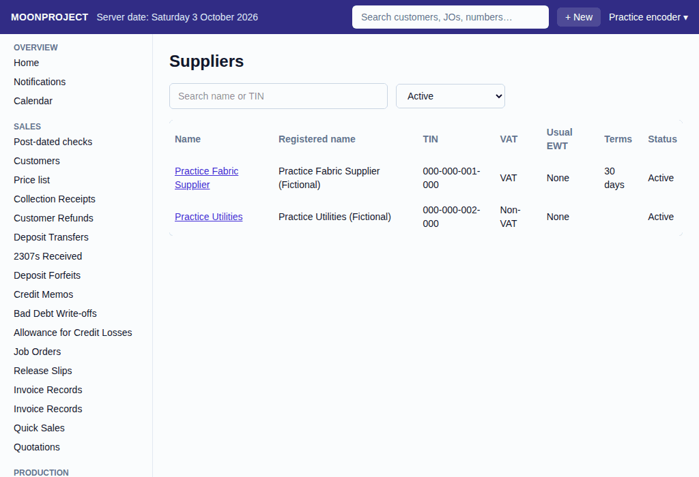
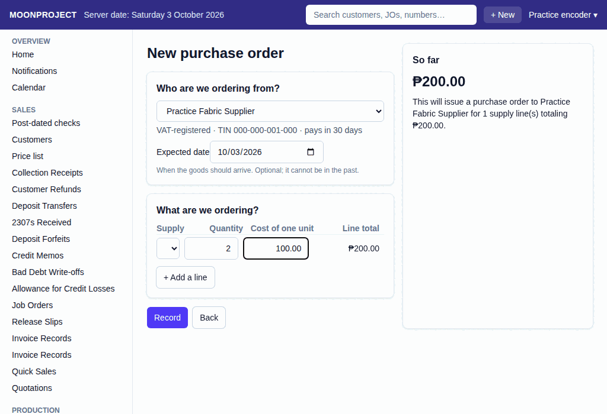

# 30. Suppliers and Purchase Orders

**What it is for:** Add the people and companies you buy from, keep a list of the supplies you buy, make purchase orders to ask for goods, and record when those goods arrive.

**Before you start:** Have the supplier's details ready, like their TIN and whether they are VAT-registered. You need to add the supplies they sell to the system before you can make an order.

### Steps

**To add or change a supplier:**
1. On the **Purchases & Expenses** menu, click **Suppliers**.
   
2. Click **+ New supplier** to add one, or click a supplier's name to see their **Details**.
3. Type their **Name (as staff call it)** and **Registered name**.
4. Type their **TIN** and check the **VAT-registered** box if they are.
5. Pick their **Usual withholding tax (EWT)** if you need to withhold tax from them.
6. Type their **Payment terms (days)** to know when their bills are due.
7. Click **Add supplier** or **Save changes**.

**To add or change supplier contacts:**
1. Open a supplier from the **Suppliers** list.
2. Go down to **Contacts**.
3. Fill in the name, role, phone, and email, then click **Add contact**.

**To keep your supplies list:**
1. On the **Purchases & Expenses** menu, click **Supplies**.
2. Click **+ New supply** to add a new item you buy.
3. Fill in the details, then save it. You can also click **Change** on a supply to fix its details.

**To make a purchase order:**
1. On the **Purchases & Expenses** menu, click **Purchase Orders**.
2. Click **+ New Purchase Order**.
   
3. Under **Who are we ordering from?**, pick the supplier and an **Expected date**.
4. Under **What are we ordering?**, pick the supply, and type the **Quantity** and the **Cost of one unit**.
5. Click **Record**. Check what the app shows, then click **Record** again.

**To receive goods against a purchase order:**
1. On the **Purchases & Expenses** menu, click **Receiving Reports**.
2. Click **+ New Receiving Report**.
3. Under **Which order did the goods come for?**, pick the open order.
4. Under **What came?**, look at the lines. The system shows what was ordered and what is still to receive.
5. Type what arrived in **Receiving now**. If everything arrived, click **Receive everything that is left**. You can receive part of the order now and the rest later in another report.
6. Click **Record**. Check what the app shows, then click **Record** again.
7. *Note: When the bill arrives, record it following the [Bills and Expenses](13-bills-and-expenses.md) guide.*

### What the system does for you
It keeps your list of suppliers and what you buy from them. It tracks what you ordered and helps you see what is still missing when goods arrive. When the bill comes and you record it, the system uses the supplier's TIN, VAT, and usual EWT to work out the taxes for you.

### Common mistakes and how to fix them
- **Mistake:** You entered the wrong quantity or cost on an order or report.
- **Fix:** You cannot delete recorded documents. Open the document and click **Edit**. The system will ask for a reason, cancel the old one, and record the replacement.
