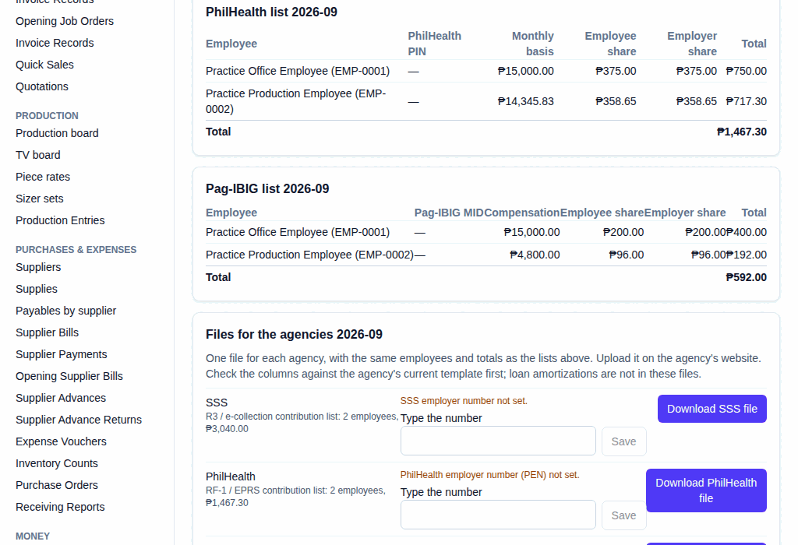
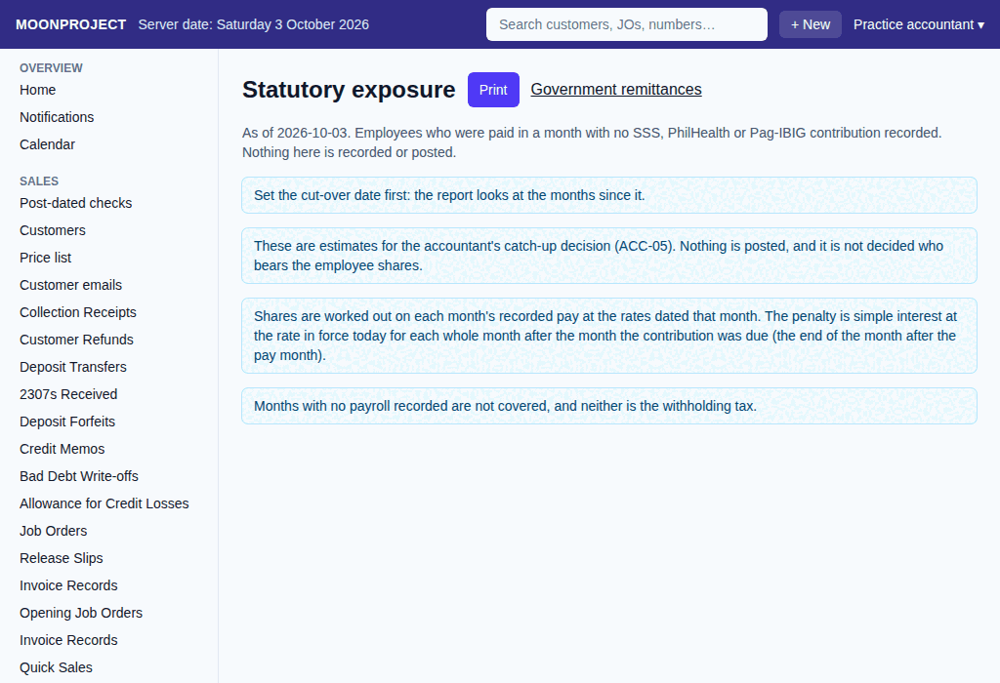

# 34. Government upload files

**What it is for:** Download the monthly contribution list files to upload to the SSS, PhilHealth, and Pag-IBIG websites. View the exposure report to see past months where an employee was paid but no contribution was recorded.

**Before you start:** You will need the permission to download upload files and the permission to see ID numbers. You will need the employer number for each agency.

### Steps
1. On the **People & Payroll** menu, click **Government remittances**.
2. Under each month the link reads **Lists and 1601-C worksheet for YYYY-MM** (like Lists and 1601-C worksheet for 2026-09). Click it.
3. On the month page, scroll down to the panel titled **Files for the agencies YYYY-MM** (like Files for the agencies 2026-09).
   
4. If an employer number is missing (like "Pag-IBIG employer ID not set"), type it in the box under **Type the number** (or **Change the number** once one is saved) and click **Save**. You will need your password for this, and the box only shows if you have permission to manage the agency numbers.
5. Click **Download SSS file**, **Download PhilHealth file**, or **Download Pag-IBIG file** to get the file for that agency.
6. Go to each agency's website and upload the downloaded file. Follow their current website steps.

To view the exposure report:
1. On the **People & Payroll** menu, click **Statutory exposure**.
   

### What the system does for you
The system automatically creates the exact file formats each agency needs (the R3 / e-collection contribution list for SSS, RF-1 / EPRS contribution list for PhilHealth, and MCRF / eSRS contribution list for Pag-IBIG). It adds up the monthly compensation, employee share, and employer share for every employee paid in that month.

The Statutory exposure report lists all employees who were paid in a past month but have no contribution recorded. It shows the months, the compensation, what the shares should have been, and estimates the late penalty. The **Statutory exposure** screen has a **By scheme** panel and a **By employee** panel, with the pay, the shares, months late and the penalty. It posts nothing. You can print it by clicking the **Print** button.

### Common mistakes and how to fix them
- **Mistake:** A button to download a file is disabled, or a whole section is missing.
- **Fix:** If the list of employees for an agency is empty for that month, the download button is disabled. If you cannot see the upload files section at all, you lack the permission to download files or view ID numbers. Ask the owner to grant these permissions.
- **Mistake:** The file is refused with a message that it was not made because employees have no ID number (like "The SSS file for 2026-09 was not made: no SSS number for..."), or because the employer number is missing.
- **Fix:** Moonproject refuses to make the file if information is missing. Add the ID number on the employee record, or type the missing employer number in the box, then download it again.
