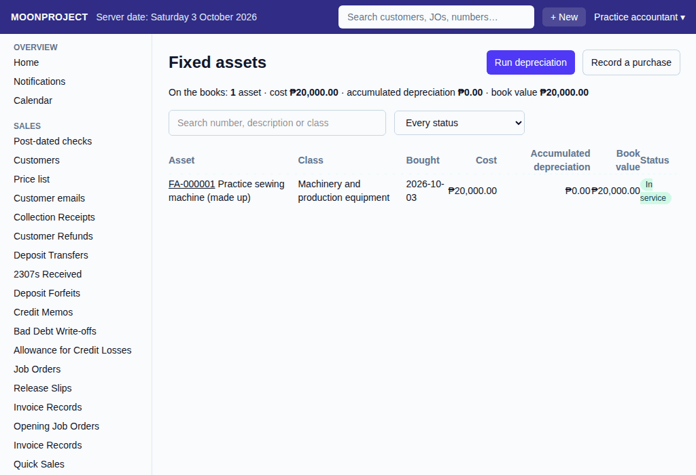
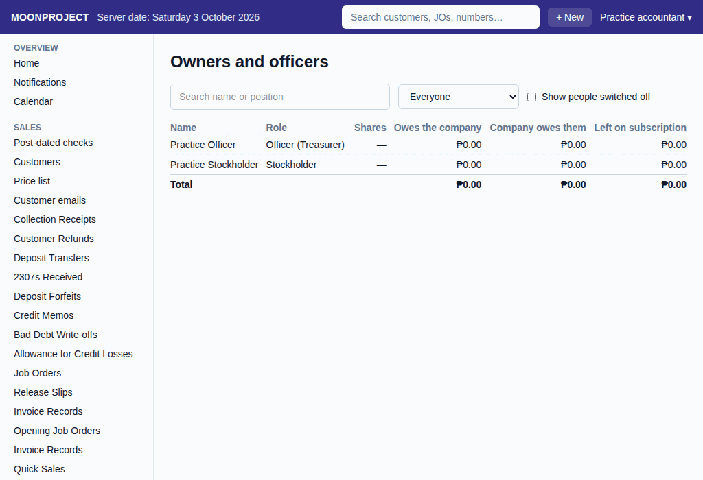

# 36. Fixed assets, loans and owners

**What it is for:** See your fixed assets (like equipment), your loans, and the people who own or run the business. Check asset values and depreciation, track late loan payments, and record money moving between the company and its owners or officers.

**Before you start:** You will need to know which list you want to look at. For making changes, know the asset you are depreciating or throwing away, the loan you are paying, or the owner/officer bringing in or taking out money.

### Steps
1. On the **Money** menu, click **Fixed assets**, **Loans**, or **Owners and officers**.
2. **For fixed assets:**
   - You can see the list of assets with their cost, accumulated depreciation so far, and book value.
     
   - Click **Run depreciation** to record the monthly wear and tear. Choose the **Month to depreciate** and click **Record the run**. The system will warn you if a month was missed.
   - To look closer, click an asset. To take it off the books, click **Dispose of this asset**, type in **Why is it being taken off?**, and click **Record the disposal**. Only a retirement (nothing received for it) can be recorded now. Run the month's depreciation first: the book value left is charged as a loss.
3. **For loans:**
   - You will see your loans and what is late.
   - Click a loan to see its schedule, payments made, and any late instalments.
   - If you have permission to record them, click **Record a loan** to add a new one, or **Record a payment** to pay one down.
4. **For owners and officers:**
   - You will see the list of stockholders and officers. If you have permission to view balances, you will see what they owe the company, and what the company owes them.
     
   - Click a person to see **What is due**, their **Owner money**, **Officer money out and back**, and the **Officer ledger**.
   - If you have permission to record them, click **Record owner money** for owner investments, or **Record officer money out or back** when an officer takes out money or brings it back.

### What the system does for you
It keeps all these records organized and does the math for you. It tracks the exact book value of assets month by month and alerts you if you forget to run the depreciation (the warning shows on the **Fixed assets** list). Late instalments are worked out as of the server's date when you open **Loans** or a loan. If you pay less than an instalment, it is not marked paid: the rest stays due on that instalment (and shows as late once past its due date), and the next payment on it starts from what is left. If the lender agrees to forgive the rest, ask your accountant to record it. For owners and officers, it adds up all the money brought in and taken out so you always know exactly who owes what.

### Common mistakes and how to fix them
- **Mistake:** You clicked the wrong month to run depreciation or typed the wrong amount for a loan payment.
- **Fix:** Do not try to delete the record. Instead, find the wrong record, cancel it, and then redo the steps to record it correctly.
- **Mistake:** You want to record selling an asset for money, but the system only says "Take off the books" for nothing.
- **Fix:** Only a retirement can be recorded now.
