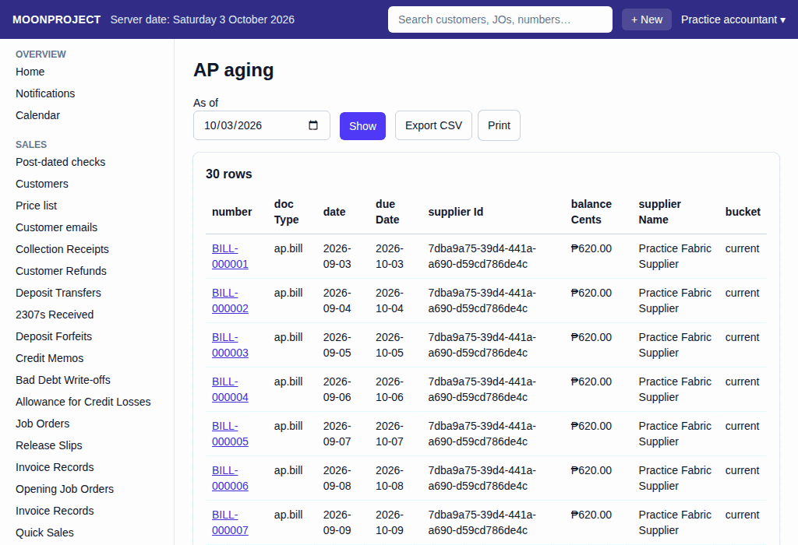
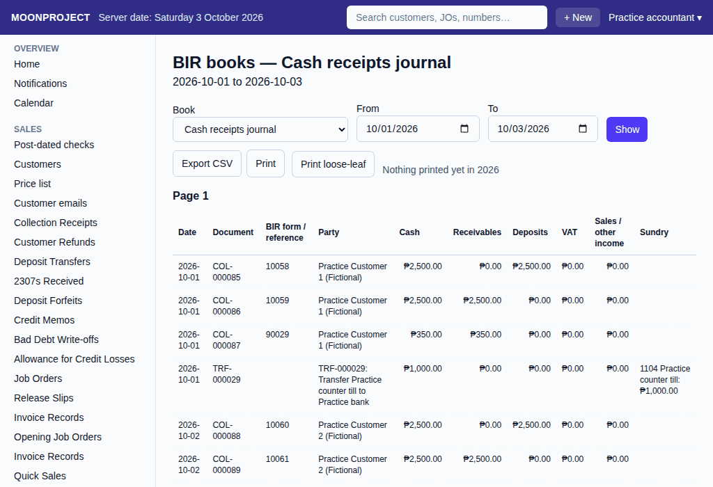

# 38. Reports and BIR books

**What it is for:** View lists and summaries of the shop's data to answer everyday questions, spot problems early, and print out the BIR books for tax records.

**Before you start:** Know what you are looking for. You will often need to put in a date, a month, a year, or a "From" and "To" date range.

### Steps
1. Open the report you want under **Reports**. It loads automatically (using this month, or today for reports asking for **As of**).
   
2. If you want a different date, pick the dates.
   - **Purchase orders by status**, **Received but not billed**, **Late entries** and **Cancellations and reissues** do not have date boxes and no **Show** button.
   - **AP aging**, **Cash position**, **Fixed-asset schedule**, and **Exceptions** use **As of**.
   - **Purchases by supplier/category**, **Transfers report**, **Cash counts**, and **Sign-in history** use **From** and **To**.
   - The **Customer statement** also needs a customer first.
3. Click the **Show** button to reload the numbers with your new dates.
4. To keep a copy, click **Print this page**, or click **Export CSV** to download a spreadsheet file.

To open the BIR books:
1. Open **BIR books** under **Reports**. It starts with the **From** and **To** dates filled in from the first of this month to today.
   
2. From the **Book** box, pick **Cash receipts journal**, **Cash disbursements journal**, **Sales journal**, **Purchase journal**, **General journal**, or **General ledger**.
3. If you want a different range, fill in the **From** and **To** dates.
4. Click the **Show** button. (The button stays off until both dates are filled and **From** is not after **To**).

### What the system does for you
It gathers all the documents and journals and lines them up based on the report you picked.

To answer everyday questions:
- **Who owes us?** Look at the **AR aging** report and the **Customer statement**.
- **What we owe suppliers?** Check the **AP aging** and **Purchases by supplier/category**.
- **How much cash is where?** View the **Cash position** and **Cash counts**.
- **What are the fixed assets worth?** Look at the **Fixed-asset schedule**.
- **Payroll and production:** Check the **Payroll register** for pay details. Use the **Production status counts**, **Production throughput**, **Worker output**, **Late job orders**, and **Job order lead time** to see how the shop floor is moving.

Control reports:
- **Late entries:** Lists journal vouchers and opening entries that were made on a later day than their date.
- **Cancellations and reissues:** Lists documents that were cancelled or reissued.
- **Exceptions:** Lists things to look at: a release with no invoice record, a cash place below zero, a draft older than 3 days, and miscellaneous expenses above 10% for the month.

For the accountant and taxes:
The BIR books screen shows pages each headed with a page number like **Page 1**, **Page 2**, and so on. **Brought forward** shows from page 2, and **Carried forward** shows at the foot of every page. You can click the **Print this page** button for a copy, or click **Export CSV** to download a spreadsheet file to send to the accountant. To print pages for the binder, click **Print loose-leaf** (it needs **From** and **To** in the same year). The screen shows the last page printed for that year, so the next print carries on from there.

### Common mistakes and how to fix them
- **Mistake:** You cannot see the **Reports** menu or the specific report you need.
- **Fix:** You do not have permission. Ask the owner to update your role so you can view reports.

- **Mistake:** The screen says "Access denied."
- **Fix:** Your login may not view the books or certain reports like payroll. The owner can change what your role may do under **Roles and permissions**.

- **Mistake:** You cannot click the **Show** button on the BIR books screen.
- **Fix:** The **Show** button is disabled until both **From** and **To** dates are set correctly.
