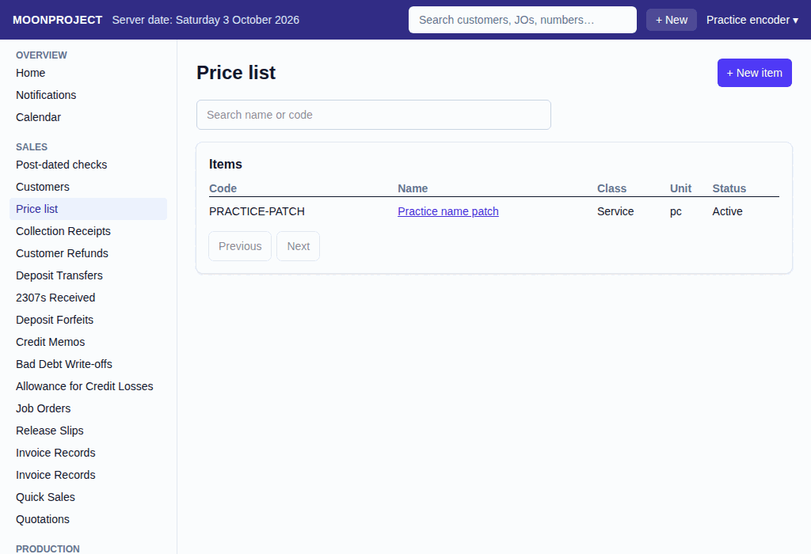
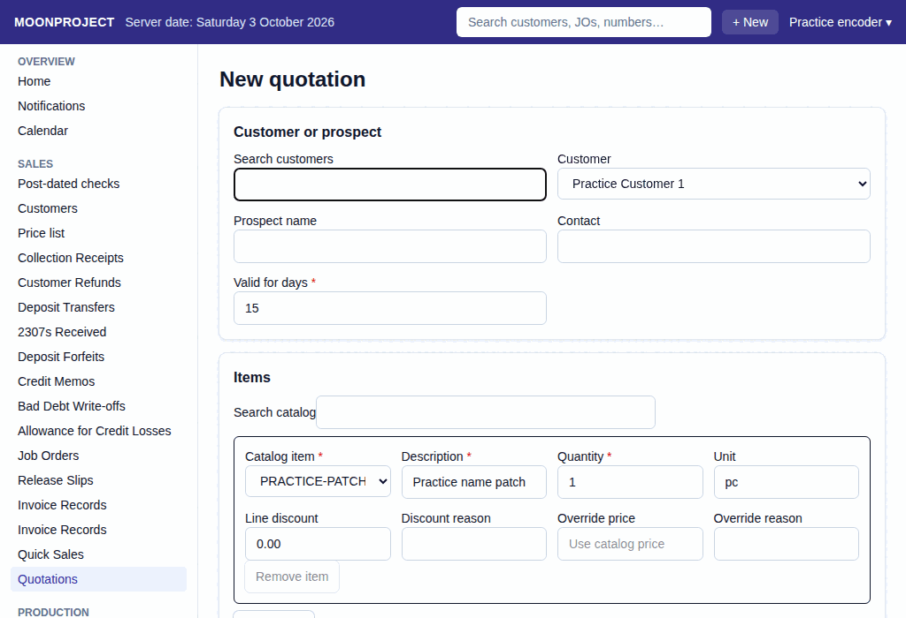

# 40. Price List and Quotations

**What it is for:** Add items and their prices to the price list, and make quotations to give to your customers or prospects.

**Before you start:** You will need the exact codes, names, classes, and units for the items you want to sell. For a quotation, you will need the customer's details and the items they want.

### Steps

#### Adding an item to the price list
1. On the **Sales** menu, click **Price list**.
   
2. Click **+ New item**.
3. Type the **Code** and **Name**.
4. Choose the **Class** (**Made-to-order garment**, **Service** or **Ready-made item**) and the **Unit** (**Piece** or **Set**). If the unit is a set, type the **Components per set**. If the class is made-to-order garment, type the **Garment type**.
5. Click **Save**. To fix the code or name later, open the item and click **Edit item**.

#### Adding or changing a price
1. On the **Price list** screen, click the name of the item. (You must have permission to manage prices, and the item must be active, or the **New effective-dated price** panel will not appear.)
2. Under **New effective-dated price**, check the **Effective from** date. It can be today or later, not earlier.
3. Type the **Minimum quantity** and the **Price per unit**.
4. Click **Save price**. Prices include VAT. An item with no price cannot be used on a quotation yet.

#### Making a quotation
1. On the **Sales** menu, click **Quotations**, then click **+ New Quotation**.
   
2. Pick the **Customer** from the list, or type a **Prospect name**.
3. Type who the **Contact** person is, and how many days the quotation is good for under **Valid for days**.
4. Under **Items**, pick a **Catalog item** for the first line. (Type in **Search catalog** to shorten the list.)
5. Type the **Description** and **Quantity**.
6. (Optional) Type a **Line discount** and the **Discount reason**, or type an **Override price** and the **Override reason**.
7. If they want more items, click **+ Add item** and repeat steps 4 to 6. **Remove item** takes a line off.
8. (Optional) Under **Terms and discount**, type a **Document discount** and **Discount reason**. Type the **Terms** and **Notes**.
9. Click **Record**. A box asks you to confirm. Or click **Save draft** to keep it without a number.

#### Printing a quotation
1. Open the recorded quotation.
2. Click **Print** (shown if you are allowed to print quotations).

#### Turning a quotation into a job order
1. Open the recorded quotation.
2. Click **Make a job order**.
3. The system fills in the details. You can change them before you click **Record**.

### What the system does for you
When you add a new price, the system keeps the old prices in the **Price history**. Old quotations will still show the old price, but new quotations will use the new price if the date and quantity match.
When you make a job order from a quotation, it says "Filled from quotation" and brings over the exact items, quantities, and prices, so you do not have to type them again. However, you will still need to pick the payment terms and due days before you record.

### Common mistakes and how to fix them
- **Mistake:** You want to change the class or unit of an item, but the fields are locked.
- **Fix:** If an item has prices, its class, garment type, and unit cannot change. Click **Deactivate**, then confirm by clicking **Deactivate** in the "Deactivate <item>?" box (which warns that an item cannot be turned back on). Then click **+ New item** to make a fresh one.
- **Mistake:** You cannot click **Make a job order** on a quotation.
- **Fix:** The quotation might be for a prospect, or your role may not be allowed to record job orders. A job order needs a real customer. Go to Customers and add them, then go back to the quotation, click **Edit**, and pick that customer.
