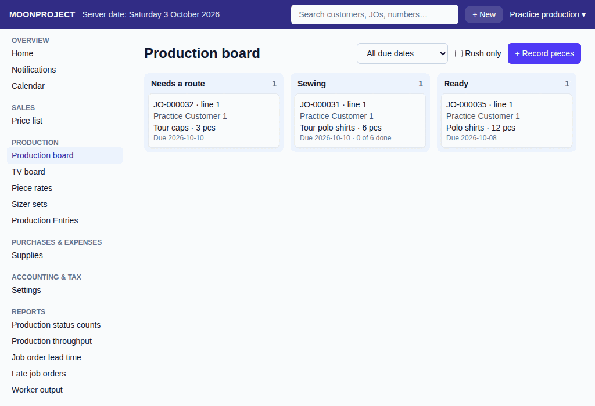
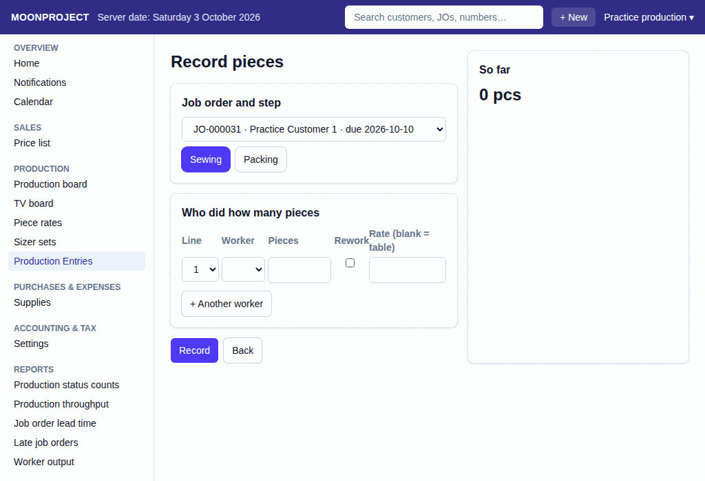

# 41. Production Board and Piece Rates

**What it is for:** View what is being made in the workroom right now, record which worker did how many pieces to work out their pay, and manage the list of piece rates.

**Before you start:** You will need the job order numbers or the physical work tickets that you want to check or record. To change the piece-rate list, you must have permission to manage rates.

### Steps
1. **To view the workroom:** On the **Production** menu, click **Production board**.
   
2. **To find a job order:** Look at the columns. New job orders are under **Choose production steps**. Job orders ready for release are under **Ready**. In the middle are the production steps. You can narrow down the list using the **All due dates**, **Due within 7 days**, or **Overdue** filters. You can also tick **Rush only**. Type a job number or customer in **Search job number or customer**. Click **Reset filters** to clear the search, due filter and Rush only. The board refreshes every 30 seconds and shows **Updated** with the last successful update time. **Not updated since** means the cards may be old; they stay visible while it tries again.
3. **To check colors:** A red **RUSH** tag means the job order is a high priority. If a card has a red line on the left side and a red due date, it is overdue.
4. **To set up or change a route:** Click the job order card on the board. Choose the steps it must go through, the garment type, and the complexity. Click **Save production steps**. If you need to fix a mistake later, click the card and click **Change production steps**.
5. **To record pieces done:** On the **Production** menu, click **Production board**, then click **+ Record pieces**. The card's box on the board also has a **Record pieces** link per step, which opens the form with that job order and step filled in.
   
   * Under **Job order and step**, choose the **Job order** and the **Step**.
   * Under **Who did how many pieces**, choose the **Line** and the **Worker**. Type the number of **Pieces**.
   * If a worker is fixing mistakes, open **Change rate or record rework** and tick **Rework (pasubra)**. Ticking **Rework (pasubra)** also needs a typed rate: "Row N: type the rework (pasubra) rate." A typed rate needs a reason in the **Why this rate?** box ("say why this rate is typed").
   * The **Rate per piece** shows the last calculated rate. To change it, open **Change rate or record rework**. The **Rate (blank = table)** box starts empty. Leave it blank and the server takes the rate from the table.
   * To add more workers for the same step, click **+ Another worker**.
   * If you record more pieces than the last step finished, you must explain why under **Why more pieces than came out of the step before? (at least 10 characters)**.
   * Click **Record**.
6. **To mark a step as finished:** Click the job order card on the board. Click **Complete**. If the step is no longer needed, click **Not needed**. **Not needed** shows only for a step that is still pending. If a step was closed by mistake, click **Reopen**. **Reopen** opens a box "Reopen <step>?" that asks for a reason and says "The step goes back to work until it is completed again. The job order is no longer ready."
7. **To view the TV board:** On the **Production** menu, click **TV board**. This is a big screen for the workroom wall. It refreshes every 30 seconds so everyone can see what to do next.
8. **To manage piece rates:** On the **Production** menu, click **Piece rates**. You can find rates by typing in the **Search garment type** box, or tick **Show history (rates that start later too)** to see old or future rates.
9. **To add a new rate:** Under **New rate**, pick the **Garment type**, **Step**, and **Complexity**. Type the **Rate per piece**, the date it starts under **From (today or later)**, and the reason under **Why (at least 10 characters)**. Click **Save rate**.

### What the system does for you
The production board sorts your job orders into columns so you know exactly where each one is. When you record pieces, the system adds them to the worker's payroll. If you set a new piece rate to start next week, the system will keep using the old rate until the new date arrives, and pieces already recorded will keep the rate they originally got.

### Common mistakes and how to fix them
- **Mistake:** You recorded pieces for the wrong worker.
- **Fix:** Do not try to delete the record. Under **Production Entries** on the **Production** menu, open the entry and click **Edit**, and put in the correct worker. The system will cancel the old record and make a new one.
- **Mistake:** A step is not showing on the entry screen.
- **Fix:** The step might not be set up on the job order's route. Go to the Production board, click the job order, and click Change production steps to add the missing step. Or, the step might already be marked as Complete. Go to the board, click the job order, and click Reopen next to that step.
