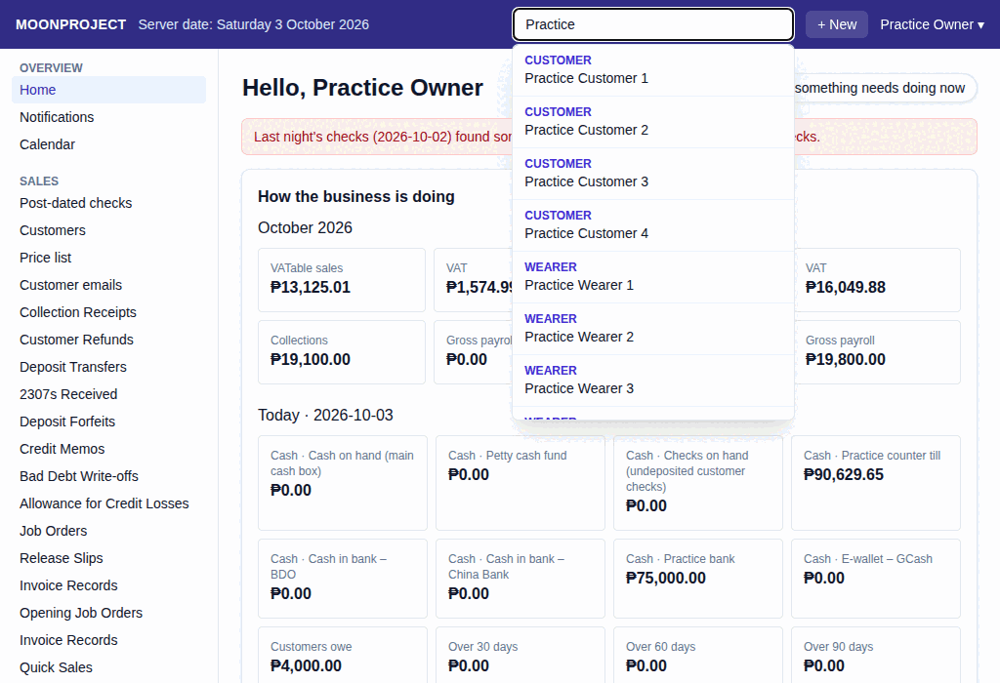
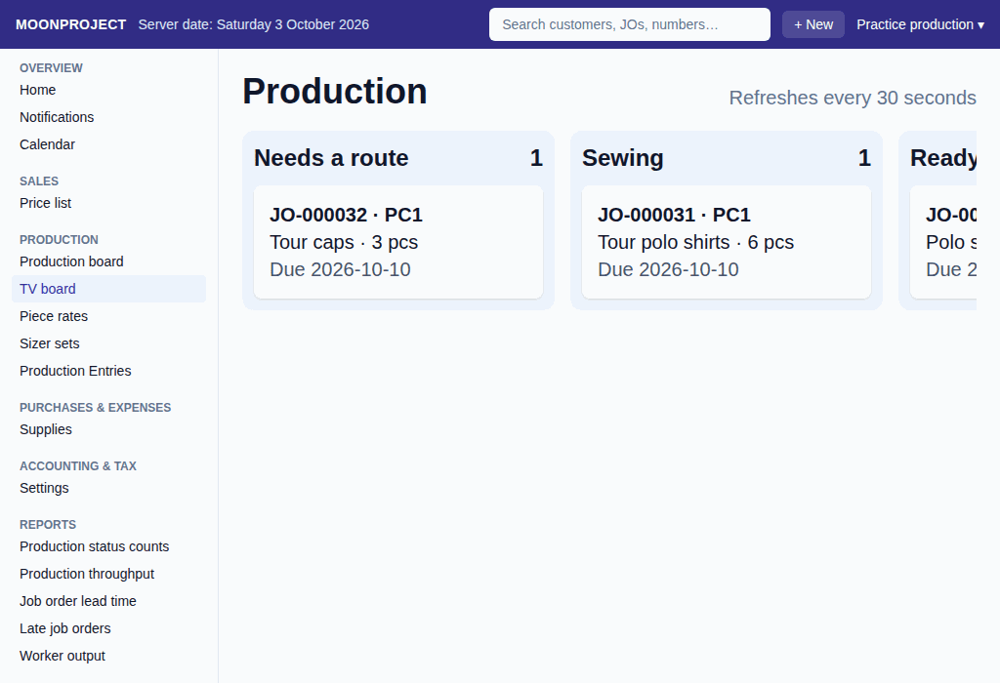

# 43. Home, Search and TV Board

**What it is for:** See your daily alerts on the home screen, find any record quickly using search, and display the production status on a large screen in the workroom.

**Before you start:** You will need to sign in to the system. Each person sees only what their role allows them to see.

### Steps
1. **Home screen:** On the **Overview** menu, click **Home**.
   On a phone, tap **Menu** first. The menu opens over the page and closes when you choose a screen. Tap **Close menu** or the shaded area to close it without moving.
2. **Search:** Click or tap the **Search customers, JOs, numbers…** box at the top of the screen and type what you are looking for.
   
3. **TV board:** On the **Production** menu, click **TV board**.
   

### What the system does for you
- **On the Home screen:** Start with **Needs attention**, a list of up to 8 work reminders and unread alerts already available to your role. Warnings, overdue work and due dates come before routine activity. Click a reminder to open its screen. You can click **Mark read** on an alert when you are done with it, or **See all notifications** to open the full **Notifications** screen (also on the **Overview** menu). **Daily actions** follows with up to four shortcuts for your role. Open **More role details** for the full lists, such as **My drafts**, **Exceptions inbox**, **Ready for release** or **Production queue**. Figures such as **Sales this month**, **Collections this month** and **Cash position**, and the owner's business figures and charts, come below the work and actions.
- **Creating another document:** Click **+ New** at the top. Documents are grouped like the left menu. Use **Search new documents** to find a document or group, then click its name. Scroll within the menu for more choices; every document you may create remains there. **No matching documents** means this menu search found nothing; clear the search to see all choices again.
- **When searching:** When you type 2 letters or more in the search box, it says **Searching…** while waiting. The newest search shows matches headed by the kind: **Customer**, **Wearer**, **Job order**, **Document**, and, if you may see them, **Supplier** and **Employee**. If nothing fits it says **No matches**. A connection failure says **Cannot search right now. Check the connection and try again.** Click **Retry search** after checking the connection. Click on a suggestion to go straight to that record.
- **On the TV board:** It displays a large **Production** board showing the same columns as the production board (**Needs a route**, the steps, **Ready**). Each card shows the job order number, the customer's initials, the item, pieces, and "Due [date]". The screen automatically updates, saying **Refreshes every 30 seconds**, so you never need to reload it. Urgent orders stand out with a red **RUSH** indicator.

### Common mistakes and how to fix them
- **Mistake:** You cannot find a document, see a specific notification on your home screen, or the search box is missing entirely.
- **Fix:** You might not have permission for that part of the system, including permission to search. The owner must go to Users or Roles and permissions to give you access.
