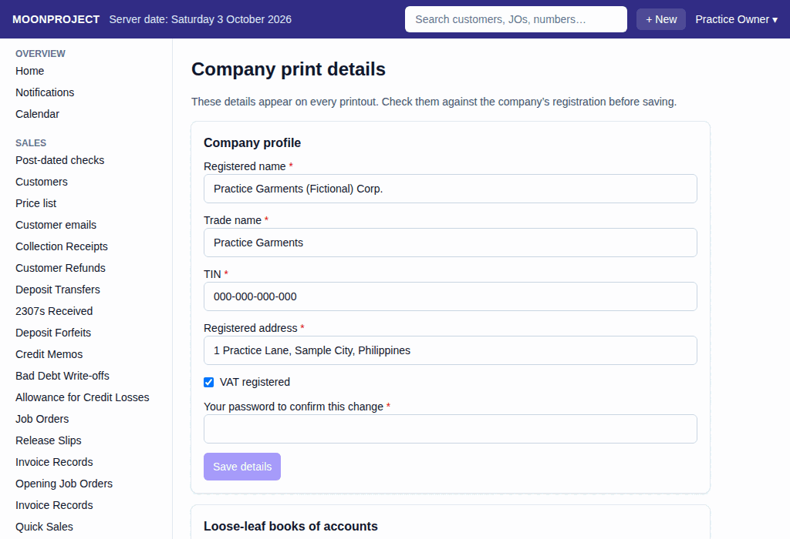
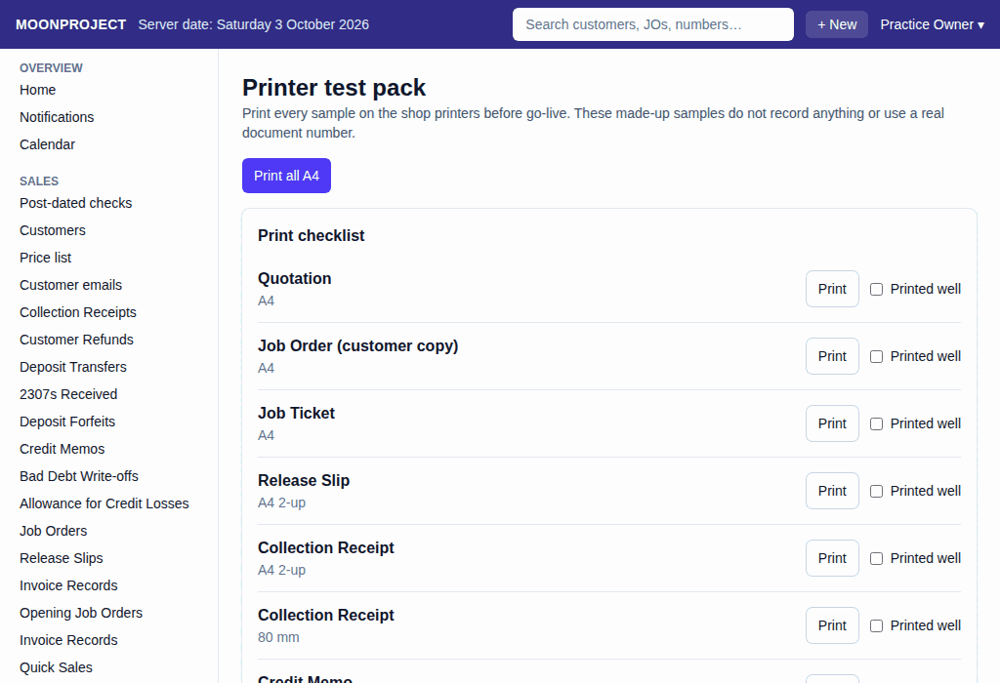

# 44. Company Print Details and Printer Test Pack

**What it is for:** Set the company's registered name, TIN, and address that appear on every print. Also, test the shop printers before the switch-over.

**Before you start:** You need the exact registered name, TIN, and address of the business. You also need your password to save the changes. Ensure your printers are on.

### Steps

**To set the company print details:**
1. On the **Admin** menu, click **Company print details**.
   
2. Type the **Registered name**, **Trade name**, **TIN**, and **Registered address**.
3. Check the **VAT registered** box if the business is VAT registered.
4. Type **Your password to confirm this change**.
5. Click **Save details**. All four boxes must be filled in.

**To choose the paper for the loose-leaf books:**
1. On the same screen, under **Loose-leaf books of accounts**, pick the **Paper**: **A4 portrait** or **Long bond paper (8.5 × 13 in)**.
2. Type **Your password to confirm this change** and click **Save paper**.

**To test the printers:**
1. On the **Admin** menu, click **Printer test pack**.
   
2. To test the A4 pages, click **Print all A4**. Each sample prints with a "TEST PRINT, NOT A REAL DOCUMENT" stamp.
3. For other pages, look under the **Print checklist**. Click **Print** next to each form to send it to the printer.
4. Check the printed pages. If they look good, check the **Printed well** box next to each one.

### What the system does for you
The system puts your company print details on every document you print. On the quotation, job order, release slip, purchase order, collection receipt, credit memo and payment voucher, it prints the line "THIS DOCUMENT IS NOT VALID FOR CLAIM OF INPUT TAX."

Every time you print a document, the system counts it. The footer reads "Original print · Copy 1" the first time, then "REPRINT no. 1 · Copy 2" and so on.

The printer test pack gives you made-up samples printed with your saved company print details, so set those first (a made-up company is shown until you do). The BIR books' samples use the paper you picked for the loose-leaf books. You can use this to check how each form prints on each printer before the switch-over. The samples do not record anything or use a real document number. Any forms listed under **Not built** are not built.

### Common mistakes and how to fix them
- **Mistake:** You typed the wrong TIN or address.
- **Fix:** Go back to the **Company print details** screen. Type the correct details, type your password, and click **Save details**. You can view old details under **Earlier versions**.
- **Mistake:** A printed page looks cut off or wrong.
- **Fix:** Uncheck the **Printed well** box. The **Printed well** ticks are kept in this browser only.
