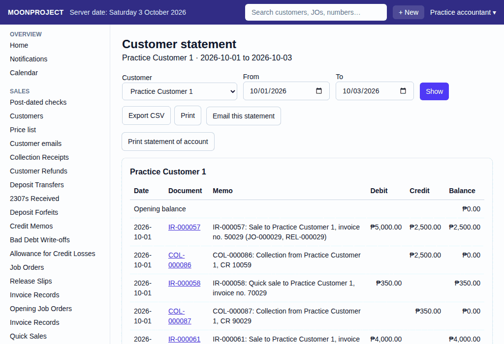

# 50. Printing statements and schedules

**What it is for:** Print important documents like a customer's statement of account, a wearer's sizing profile, or the fixed asset schedule.

**Before you start:** Make sure you have a working printer connected to your computer.

### Steps

**To print a customer's statement of account:**
1. On the **Reports** menu, click **Customer statement**.
2. Pick the customer in the **Customer** field (it starts as "Choose a customer").
3. Type the **From** and **To** dates.
4. Click **Show** (this button stays off until a customer and both dates are set, and **From** is not after **To**).
   
5. When the report is showing, click **Print statement of account**.

**To print a wearer's sizing profile:**
1. Click **Sales**, then **Customers**, then open the customer.
2. In the **Wearers** panel, click on a wearer's name to open their **Measurements**.
3. If the wearer has a current measurement revision and your login may see measurements, click **Print sizing profile**.

**To print the fixed asset schedule:**
1. On the **Reports** menu, click **Fixed-asset schedule**.
2. Type the **As of** date.
3. Click **Show**.
4. When the report is showing, click **Print fixed asset schedule**.

### What the system does for you
The system builds a document ready for printing and opens it in a new window. It gathers all the lines, balances, and totals for statements and schedules. The sizing profile lists Wearer, Customer, Group, Measured on, Upper size, Lower size, a Measurement / Value / Unit table and Remarks. Note that the customer's statement of account will say "THIS DOCUMENT IS NOT VALID FOR CLAIM OF INPUT TAX."

### Common mistakes and how to fix them
- **Mistake:** You click the print button but nothing happens, and you see a message saying "Allow pop-ups for this site, then try Print again."
- **Fix:** Allow pop-ups for this site, then try Print again.
- **Mistake:** The print stops with "An owner must complete the company profile before printing."
- **Fix:** An owner must complete the company profile before printing (see guide 44).
