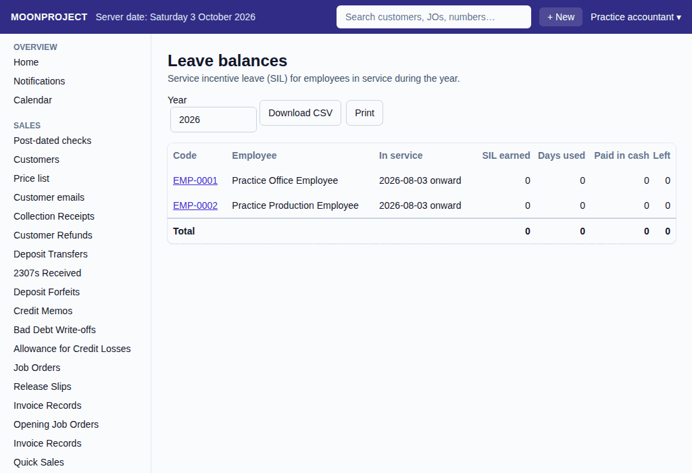

# 52. Leave balances

**What it is for:** View the yearly service incentive leave (SIL) balances for everyone who was in service during a selected year. Service incentive leave is five days of paid leave given to an employee who has worked for at least one year.

**Before you start:** You will need to know which year you want to check the leave balances for.

### Steps
1. On the **People & Payroll** menu, click **Leave balances**.
   
2. Type the **Year** you want to view (it opens on this year). The list changes by itself. Click an employee's **Code** to open their record.

### What the system does for you
It calculates and shows the SIL balances for all employees who were in service during the year you picked. The list has these columns:
- **Code:** The employee's code.
- **Employee:** The name of the employee.
- **In service:** The date the employee started, and the date they left (or "onward" if they are still with you).
- **SIL earned:** The leave days for the year (5), once the employee has a year of service. It shows 0 before that.
- **Days used:** The days marked **Leave (SIL)** in the attendance grid for that year.
- **Paid in cash:** The unused leave days a recorded payroll run paid in cash.
- **Left:** The leave days remaining.

A **Total** line at the bottom adds up each column.

You can click **Download CSV** to save the list to your computer, or click **Print** to print it. If you open an employee's own page, you will see the same figures under **Paid leave (SIL)** for the year. No pay amounts are shown on this list.

### Common mistakes and how to fix them
- **Mistake:** You cannot find an employee in the list.
- **Fix:** Check that the employee was in service during the **Year** you picked. Someone who started after that year, or left before it, is not listed. If nobody was in service, the screen says so.
