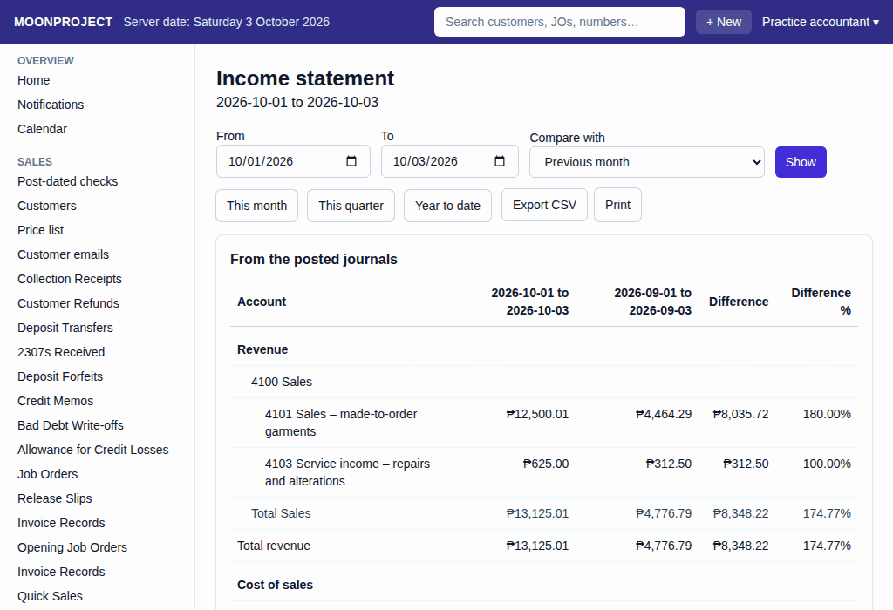

# 54. Comparing Statements

**What it is for:** View the income statement or balance sheet for a certain period alongside the previous month or the same period last year to see how the business is doing over time.

**Before you start:** Know whether you want to look at the income statement or the balance sheet, the dates you are interested in, and what period you want to compare it to.

### Steps
1. On the **Reports** menu, click **Income statement** or **Balance sheet**.
2. If you chose the income statement, check the **From** and **To** dates (it opens on 1 January to today). You can also click **This month**, **This quarter** or **Year to date**. If you chose the balance sheet, check the **As of** date (it opens on today).
3. Under **Compare with**, pick **Previous month** or **Same period last year**. (**None** shows the statement on its own.)
   
4. Click **Show** (the quick buttons on the income statement show straight away).

### What the system does for you
It shows the statement with two columns of amounts side-by-side. The first column is the period you asked for, and the second column is the period you chose to compare it to. Each column is headed with its dates.

It also adds two more columns:
- **Difference:** How much the amount went up or down compared to the earlier period.
- **Difference %:** The difference shown as a percentage of the earlier amount.

If the amount in the earlier period was zero, the **Difference %** is left blank, because you cannot work out a percentage change from nothing. Amounts in brackets are negative.

You can click **Export CSV** to download a copy of the numbers to open in Excel, or click **Print this page** to get a paper copy.

### Common mistakes and how to fix them
- **Mistake:** You picked a comparison under **Compare with** but the screen still shows one column.
- **Fix:** Click **Show** again after choosing. The comparison only appears after **Show** (or a quick button on the income statement).
- **Mistake:** **Show** on the income statement is off.
- **Fix:** Fill in both **From** and **To**, and make sure **From** is not after **To**. On the balance sheet, fill in **As of**.
