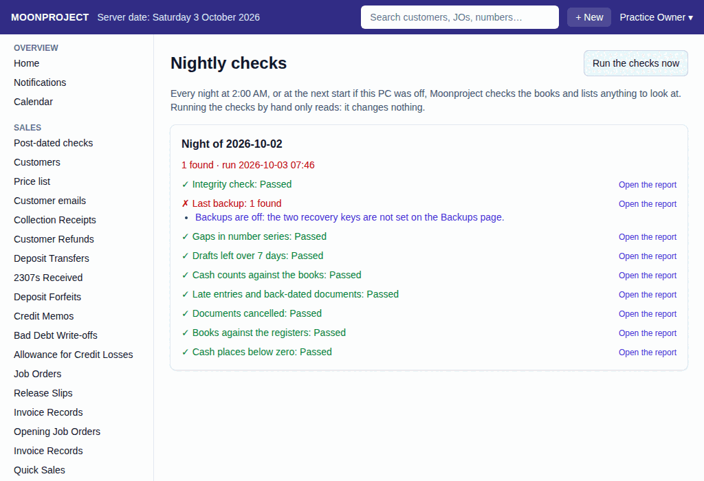

# 56. Nightly checks

**What it is for:** View the status of the nightly checks and run them now.

**Before you start:** Know that the Integrity check is found in the **Admin** menu as **Integrity check**.

### Steps
1. On the **Admin** menu, click **Nightly checks**.
   
2. To check right now, click **Run the checks now** (only people with that permission, usually the owner, see this button). The button shows **Checking…**, then a box called **Checked just now** appears with the results.
3. Each earlier run is a box called **Night of** and the date. To see more of them, click **Show older nights**.

### What the system does for you
Every night at 2:00 AM, or at the next start if this PC was off, Moonproject checks the books and lists anything to look at. Running the checks by hand only reads: it changes nothing.

It checks:
- Integrity check
- Last backup
- Gaps in number series
- Drafts left over 7 days
- Cash counts against the books
- Late entries and back-dated documents
- Documents cancelled
- Books against the registers
- Cash places below zero

Each check has a green ✓ and **Passed**, or a red ✗ and a number such as **3 found**. A night with nothing found says **Everything passed**; otherwise it says how many were **found**. If no check has run yet, you see **No nightly check has run yet. The first one runs at the next 2:00 AM.** Click **Open the report** next to a check to see more details.

### Common mistakes and how to fix them
- **Mistake:** You see **Access denied.**
- **Fix:** You do not have permission to see this page. Ask the owner.
- **Mistake:** You see a red **✗** with a number and **found** next to a check.
- **Fix:** Click the lines under it to look at each one, or **Open the report**. Tell your accountant or IT person if you cannot fix it. The same news shows on Home as **Last night's checks (...) found ... to look at**.
