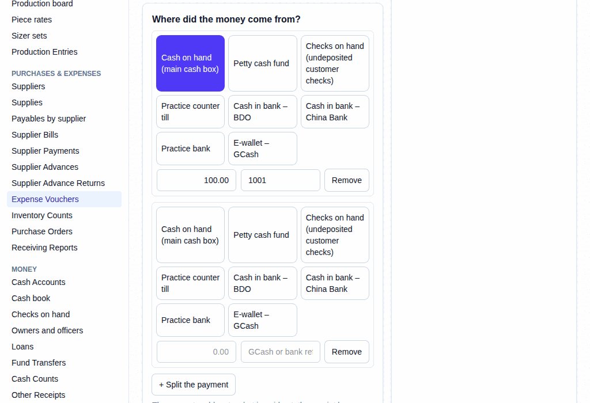

# 57. Expense paid from several places

**What it is for:** Record an expense paid right away, but the money came from two or more places (like partly from petty cash and partly by GCash).

**Before you start:** Know what the expense was for, who was paid, and have the receipt ready. You will need to know exactly how much came from each cash place.

### Steps
1. On the **Purchases & Expenses** menu, click **Expense Vouchers**.
2. Click **+ New Expense Voucher**.
3. Under **What was it for?**, pick the **Expense** and type a **Description**.
4. Under **Who was paid?**, pick **Someone not on file** or **A supplier on file** and type their **Name** and **TIN**, and tick **VAT-registered (a VAT receipt)** if it applies. For a supplier on file, pick the supplier.
5. Under **The receipt**, type the **Amount (VAT included)**, the **Receipt no.**, and pick the **Receipt date**. Pick the **Tax withheld from supplier (EWT)** if needed.
6. Under **Where did the money come from?**, click the first cash place.
7. Type the **Amount** for that cash place and any **Reference** (like a GCash or bank reference, or check no. and bank).
8. Click **+ Split the payment** to add another cash place. You can add up to four places in total.
   
9. Click the second cash place, type its **Amount**, and add a **Reference**.
10. The amounts must add up to what is paid out: the receipt less any tax withheld from the supplier (EWT). If you need to remove a row, click **Remove**.
11. Click **Record**. Read the sentence in the box **Record this Expense Voucher?**, then click **Record** again. Click **Go back** if something is wrong.

### What the system does for you
It records the expense and takes the correct amount of money from each cash place. It works out the VAT and EWT. The box before you record it tells you what will happen, reading like: "This will record [amount] for [expense] paid to [payee] from [cash places], with [input VAT] input VAT; [amount] is withheld (EWT [rate]), so [amount] is paid out". If the money came from two places, it names both with their amounts.

### Common mistakes and how to fix them
- **Mistake:** You see "The money paid out (...) must be (...)".
- **Fix:** The amounts from your cash places do not add up to the receipt less any tax withheld from the supplier (EWT). Adjust the amounts.
- **Mistake:** You recorded it wrongly.
- **Fix:** You cannot delete it. Open the voucher and click **Edit** to record a corrected one, or click **Cancel**, type a reason, and click **Cancel document**. Then record a new one.
