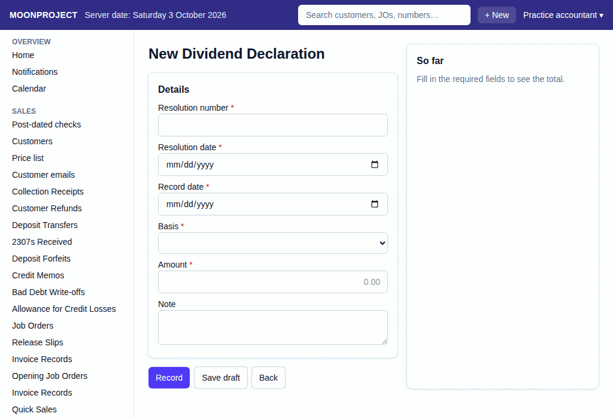

# 60. Dividends

**What it is for:** Declare a cash dividend and pay the money to the stockholders.

**Before you start:** Have the board resolution for the dividend. Know the record date (the stockholders on the books at the end of that day get the dividend) and either the amount per share or the total amount. The shares of each stockholder must be in the register (**Owners and officers** on the **Money** menu).

### Steps
**To declare a dividend:**
1. On the **Money** menu, click **Dividend Declarations**.
2. Click **+ New Dividend Declaration**.
   
3. Type the **Resolution number**, and pick the **Resolution date** and the **Record date**. The record date must be today or earlier.
4. Pick the **Basis**: **per_share** (an amount for each share) or **total** (the whole dividend).
5. Type the **Amount**.
6. Type a **Note** if you want.
7. Click **Record**. Read the box **Record this Dividend Declaration?**, then click **Record** again. Click **Go back** if something is wrong.

**To pay a stockholder:**
1. On the **Money** menu, click **Dividend Payments**.
2. Click **+ New Dividend Payment**.
3. Under **Which stockholder was paid?**, pick the stockholder from the list.
4. Under **Where did the money come from?**, click the cash place.
5. Type the **Amount paid (the dividend less the final tax withheld)**.
6. Type a **Note** if you want, like the check number or bank reference.
7. Click **Record**. Read the box **Record this Dividend Payment?**, then click **Record** again.

### What the system does for you
When you declare a dividend, it splits the amount by the shares each stockholder held at the end of the record date. For an individual stockholder, it withholds the final tax (10% unless the accountant changed it in **Settings**) and records the rest as owed to them. The box before you record reads like: "This will declare a cash dividend of [amount] (board resolution [number]) ... to [number] stockholders of record on [date]". When you record a payment, it takes the money from the cash place and lowers what the company owes that stockholder. The box reads like: "This will record [amount] of dividends paid to [name] from [cash place]."

### Common mistakes and how to fix them
- **Mistake:** You see "Retained earnings on [date] are [amount] ... This dividend of [amount] would leave [amount]."
- **Fix:** The dividend is more than the retained earnings left. Declare a smaller amount.
- **Mistake:** You see "The record date [date] has not ended, so who holds the shares is not known yet."
- **Fix:** Wait until the day after the record date, then record the declaration.
- **Mistake:** You see "[name] has no TIN in the register: the 1601-FQ and the 1604-F need it."
- **Fix:** It is only a warning. Have the TIN added to the register of stockholders before you file those returns.
- **Mistake:** You see "The company owes [name] only [amount] in dividends."
- **Fix:** You typed more than is owed. Type the amount less the final tax withheld.
- **Mistake:** You recorded it wrongly.
- **Fix:** You cannot delete it. Open it and click **Edit** to record a corrected one, or click **Cancel**, type a reason, and click **Cancel document**.
