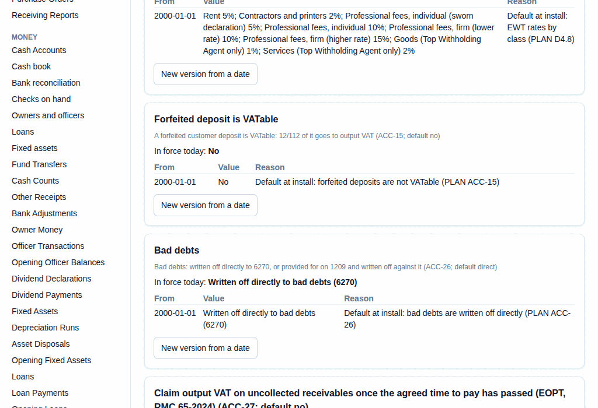

# 61. Allowance for credit losses

**What it is for:** Choose how bad debts are handled, set an allowance for amounts that may not be collected, and write off an invoice that will not be paid. This guide is for the accountant.

**Before you start:** Bad debts are written off directly unless the accountant chose the allowance method (go-live decision ACC-26). Know the rates you use for each age of receivable, or the allowance you need.

### Steps
**To set the bad debt method:**
1. On the **Accounting & Tax** menu, click **Settings**.
2. Find the **Bad debts** setting and click **New version from a date**.
   
3. Pick **Written off directly to bad debts (6270)** or **Allowance for credit losses (1209), written off against it**, pick the date, type a **Reason**, and click **Preview the change**, then **Save this version**.

**To set the allowance:**
1. On the **Sales** menu, click **Allowance for Credit Losses**.
2. Click **+ New Allowance for Credit Losses**.
3. Pick **Allowance per customer or in total**: **customer** or **total**.
4. Type the rate for each age, in basis points (100 = 1%): **Not yet due**, **1–30 days overdue**, **31–60 days overdue**, **61–90 days overdue** and **Over 90 days overdue**.
5. For **total** only, you may type **In total: allowance needed, if not the suggested amount**.
6. Type the **Reason**.
7. Look at **So far** for the total and any messages.
8. Click **Record**. Read the box **Record this Allowance for Credit Losses?**, then click **Record** again.

**To write off an invoice:**
1. On the **Sales** menu, click **Bad Debt Write-offs**.
2. Click **+ New Bad Debt Write-off**.
3. Under **Customer**, pick the customer. Under **Which invoice?**, pick the invoice.
4. Type **Why is it written off? (at least 10 characters)**.
5. Click **Write off**. Read the box, then click **Record**.

### What the system does for you
It suggests the allowance from the Unpaid customer balances (AR aging): what each customer owes in each age, times your rates. It records only the change from the allowance already held. The box reads like: "This will set the allowance for credit losses on [date] (per customer) at [amount], from [amount] ...". With the allowance method, a write-off is charged against the allowance instead of straight to bad debts. A write-off takes all that the invoice still owes. Its output VAT stays.

The **Unpaid customer balances (AR aging)** report (on the **Reports** menu) shows **Less allowance for credit losses** and **Net receivables**. The **Balance sheet** shows the allowance under the receivables.

### Common mistakes and how to fix them
- **Mistake:** You see "The allowance for credit losses holds [amount], [amount] short of the [amount] to write off. Raise the allowance first".
- **Fix:** Record a new **Allowance for Credit Losses** that is high enough, then do the write-off.
- **Mistake:** You see "Bad debts are written off directly on [date] ... so the allowance can only go down."
- **Fix:** Change the **Bad debts** setting to the allowance method first.
- **Mistake:** You see "The allowance already holds [amount] as needed on [date], so there is nothing to post."
- **Fix:** Nothing changed. Check the rates.
- **Mistake:** You wrote off the wrong invoice.
- **Fix:** You cannot delete it. Open it and click **Cancel**, type a reason, and click **Cancel document**.
