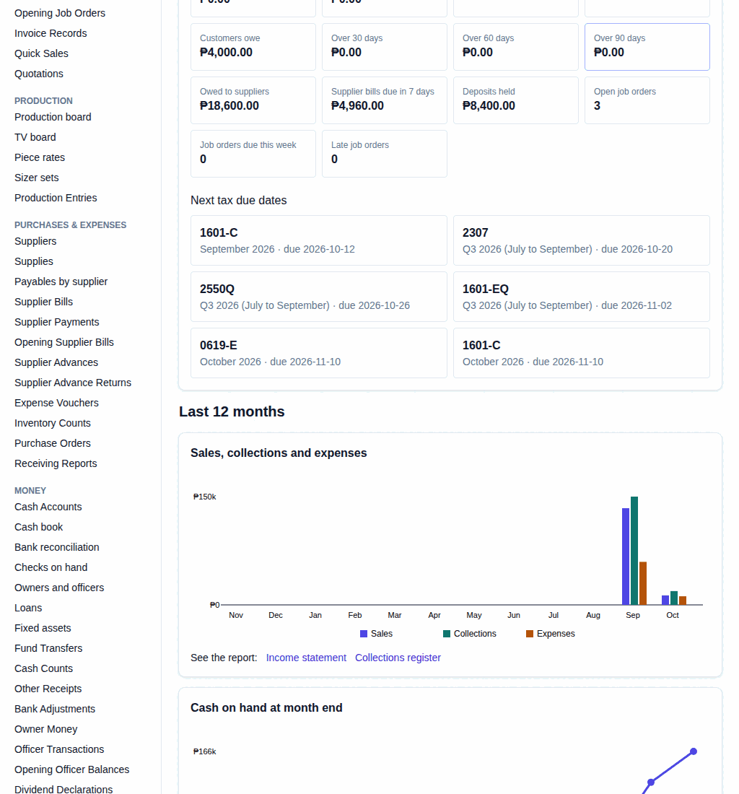

# 63. Owners' charts and monthly pack

**What it is for:** See charts of how the business did over the last 12 months, and print a pack of reports for the co-owners' meeting.

**Before you start:** The charts show only on an owner's **Home** who may view the books. To print the pack, you need to be allowed to view the books.

### Steps
**To see the charts:**
1. On the **Overview** menu, click **Home**.
   
2. Look under **Last 12 months**:
   - **Sales, collections and expenses**: bars for each month's sales, money collected, and expenses. Point at a bar to see the amount. Click **Income statement** or **Collections register** to see the report.
   - **Cash on hand at month end**: a line of the money in all cash places at the end of each month (this month: today). Click **See the report** for the cash position.
   - **Receivables by age today**: what customers owe, by how many days overdue (**Current**, **1–30**, **31–60**, **61–90**, **Over 90**). Click **See the report** for the Unpaid customer balances (AR aging).

**To print the monthly pack:**
1. On the **Reports** menu, click **Monthly owners' pack**.
2. Under **Prepare the co-owners' meeting pack**, pick the **Month**.
3. Click **Print owners’ pack**.

### What the system does for you
The charts are worked out from the books each time you open **Home**. The pack is one A4 printout with the financial statements, cash flow, receivables, payroll cost and job-order activity for the month, side by side with the month before. It opens ready to print.

### Common mistakes and how to fix them
- **Mistake:** A month in the charts shows nothing.
- **Fix:** Nothing was recorded in that month, like the months before you started using Moonproject.
- **Mistake:** You do not see the charts or **Monthly owners' pack**.
- **Fix:** The charts are only for owners, and both need permission to view the books. Ask the owner to check your role.
